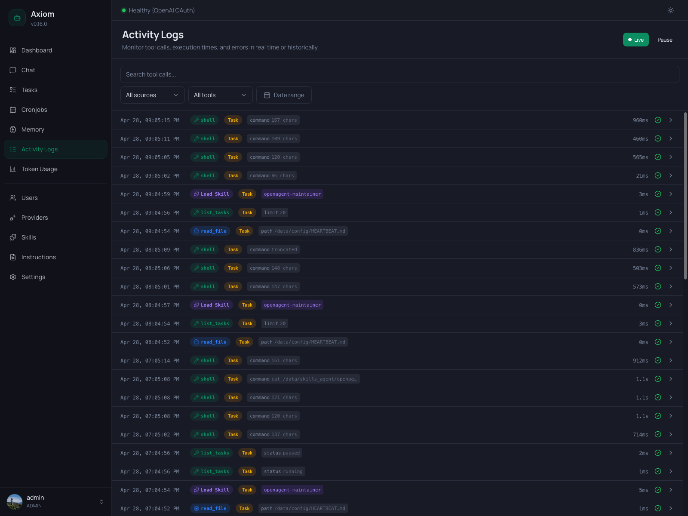

# Activity Logs

Activity Logs is the running record of every tool call the agent makes — chat agent, task agent, cronjob agent, all of them. It's where you go when you want to know *what did the agent actually do?*

The page has two modes — **Live** for real-time monitoring and **Historical** for searching, filtering, and paginating through what's already happened. Each row is one tool invocation; expanding a row shows the full input, output, timing, and which session it belonged to.

> **Admin only.** Regular users don't see this page.

> **Logs vs. Tasks.** This page is tool-call-centric — every entry is one `tool_call_end` event. The [Tasks](./tasks) page is task-centric — each entry there is a whole task agent run, and clicking into it shows the same events grouped per task. Use Tasks when you care about *outcomes*, Activity Logs when you care about *behavior across all sessions*.

## Modes

Two buttons in the page header control the mode:

| Button         | What it does                                                                                              |
|----------------|-----------------------------------------------------------------------------------------------------------|
| **Live**       | Filled green when active. New entries arrive over a WebSocket and get prepended to the top of the list.   |
| **Pause**      | Visible only in Live mode. Stops appending incoming entries to the screen *without* disconnecting — incoming events still arrive on the socket but are dropped. Click again (now labeled **Resume**) to reattach. |
| **Historical** | Outline-only when active. The list is paginated; entries don't update automatically.                      |

Clicking **Live** when you're in Historical mode (or vice versa) re-fetches the list. **Applying any filter automatically switches you out of Live mode** — searching, picking a tool, or setting a date range only makes sense against the historical record, so the page falls back to Historical until you explicitly click Live again.

The Live buffer holds the last 200 entries. Older entries roll off the top; to see further back, switch to Historical and use pagination.

If the WebSocket drops, the page reconnects automatically every 3 seconds. The Live dot stops pulsing while disconnected and resumes when the socket is back.

## Filter toolbar

A row of filters sits below the page header. They combine with AND semantics — narrowing the list further with each one you set.

| Filter         | Notes                                                                                                |
|----------------|------------------------------------------------------------------------------------------------------|
| **Search**     | Free-text search over tool call input/output. Debounced 300 ms — type and the list updates without an Apply button. |
| **All sources**| Source of the session: *All sources*, *Main Agent* (chat sessions), *Tasks* (task agent sessions).   |
| **All tools**  | A dropdown populated from every tool name that has ever appeared in the logs. Pick one to isolate it. |
| **Date range** | Picker with the standard presets (Today, Yesterday, last 7 days, …) and custom From/Until dates.     |

Setting any filter switches the page to Historical mode automatically.

## Log rows

Each row is one tool call, packed into a single line so you can scan many entries quickly. Reading left-to-right:

| Element             | Notes                                                                                                |
|---------------------|------------------------------------------------------------------------------------------------------|
| **Timestamp**       | Local time, monospace.                                                                              |
| **Tool badge**      | The tool name with an icon and a color reflecting the tool category (memory, shell, web, skill, …). For skill loads the badge reads `Load Skill`. |
| **Source badge**    | Amber `Task` badge — appears only when the call ran inside a task session. Hidden on small screens.  |
| **Input preview**   | Compact key=value chips summarizing the tool arguments (e.g. `command 167 chars`, `path /data/config/HEARTBEAT.md`, `limit 20`). For skill loads, a single violet chip shows the skill name. Hidden on small screens.|
| **Duration**        | Right-aligned, monospace. `0ms` for instantaneous calls.                                            |
| **Status icon**     | Green checkmark for success, red warning for errors.                                                |
| **Expand chevron**  | Click anywhere on the row to expand.                                                                |

Errored rows additionally get a thin red bar on their left edge so failures stand out when scrolling a long list.

### Tool badge colors

The badge color is purely a visual aid — same tool, same color across the whole list. Memory tools, shell tools, web tools, skill loads, and task tools each get their own tint so a stream of mixed activity is still readable at a glance. The exact mapping lives in the frontend's `useLogDisplay` composable; treat it as cosmetic.

### Skill loads

When the agent loads a skill (e.g. `tasks-and-cronjobs`, `nitter`), the row shows up with a violet `Load Skill` badge and a violet chip with the skill name instead of the usual key=value chips. Expanding such a row shows the loaded `SKILL.md` content directly, with no input section (the only "argument" is the skill name, which is already on the row).

## Expanded detail

Clicking a row expands an inline detail panel underneath it. Click again — or click any other row — to collapse.

The panel has up to three blocks:

### Input

The arguments that were passed to the tool, parsed as JSON and pretty-printed. Hidden when:

- The input is empty.
- The row is a skill load (covered separately, see above).
- The row is a memory operation that has a richer diff view (see below).

### Output

The result returned by the tool. By default it's a structured display of the JSON output (or plain text). Errors render in red with the same `ToolDataDisplay` component used in chat.

For three specific cases the output is replaced by a richer view:

- **`edit_file` / `Edit` on a memory file** — the panel renders an inline before/after diff of every edit instead of the raw JSON. Same renderer used in [Chat](./chat) tool cards.
- **`write_file` / `Write` on a memory file** — the panel renders the new content as an "all added" diff (since `write_file` doesn't carry a before-state).
- **Memory consolidation output** — the special diff produced by the nightly consolidation job is rendered inline so you can see exactly what was promoted from daily notes into `MEMORY.md`, user profiles, or the wiki.

In all three cases, the raw `Input` block is hidden because the diff already conveys the information.

### Meta row

A footer line under the input/output blocks with three short pieces of context:

- **Session** — the session ID this tool call belonged to. Useful for correlating across multiple tool calls in the same conversation or task run.
- **Duration** — the same value as in the row, repeated for completeness.
- **Status** — `success` or `error`.

There is no link to a session viewer from here yet — the Session ID is informational. Use it to cross-reference rows by hand or to query the database directly.

## Pagination

Visible only in Historical mode, at the bottom of the page. Standard prev/next pair with a *"Page X of Y"* label. Page size is fixed; filters reset the cursor to page 1.

In Live mode there's no pagination — the buffer is bounded to the last 200 entries.

## Empty state

When no entries match (either the database is empty or the filters are too narrow), the page shows a centered icon with the text *"No log entries found."* — clear filters or widen the date range to see more.

## See also

- [Tasks](./tasks) — task-grouped view of the same underlying events; click into a task to see *its* tool calls in order.
- [Built-in Tools](../concepts/tools) — the catalog of tools that show up in this log.
- [Memory System](../concepts/memory) — context for the memory diff views (what `MEMORY.md`, `SOUL.md`, `AGENTS.md`, dailies, and the wiki are).
- [Tasks & Cronjobs concept](../concepts/tasks-and-cronjobs) — when to expect *Task* source rows.
