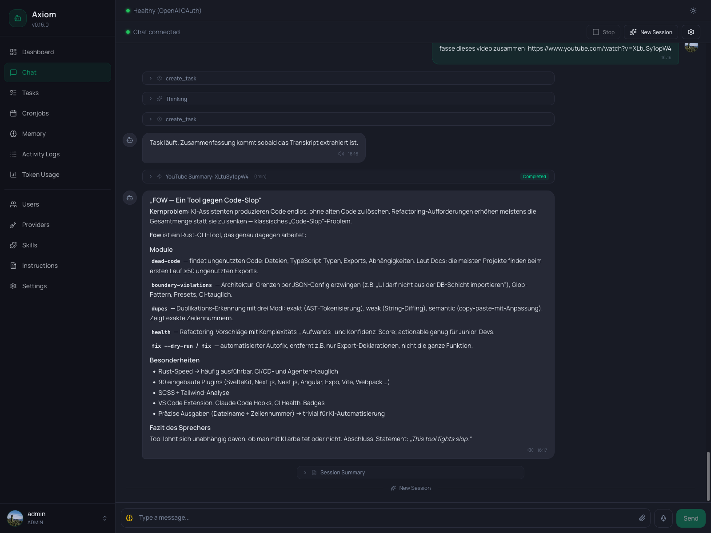

# Chat

The Chat page is the main agent conversation view and the only sidebar entry every user can access. Everything else is admin-only; this is where regular users live.

It's a streaming, persistent conversation with the configured agent — messages flow over a WebSocket, attachments upload through a separate REST endpoint, and the page reconnects automatically if the socket drops.

## Toolbar

The top of the page has a slim toolbar (`PageHeader`). On mobile its action buttons collapse into the global header bar so the second row disappears.

**Left side — connection dot:**

| Dot color | State                                                          |
|-----------|----------------------------------------------------------------|
| Green     | Connected. Messages flow live.                                 |
| Amber     | Connecting / reconnecting. The WebSocket is mid-handshake.     |
| Gray      | Disconnected. Send is disabled until the socket comes back.    |

**Right side — actions:**

- **Stop** — aborts whatever the agent is currently doing (only enabled while a response is streaming). Equivalent to typing `/stop` in chat or hitting the Kill button on the parent task.
- **New Session** — closes the current chat session and starts a fresh one. A *Session Summary* may be generated before the divider appears (see [Memory System → session summaries](../concepts/memory) for how that works). The next message you send opens a new session.
- **Settings (gear icon)** — display filters, see below.

## Display filters

The gear icon opens a popover with four toggles. Settings are persisted to `localStorage` per browser, so each operator can have their own view.

| Filter                | Default   | What it shows                                                      |
|-----------------------|-----------|--------------------------------------------------------------------|
| **Tool Calls**        | On        | Collapsible cards for each tool the agent invoked.                |
| **Injections**        | Off       | Background-task results and periodic status heartbeats.           |
| **Session Summaries** | Off       | The summary card above each session divider.                      |
| **Thinking blocks**   | On        | The collapsed *Thinking* card before each assistant turn (if any).|

Hiding a category never deletes anything — toggling the filter back on brings the messages right back.

## Message types

The chat renders many distinct shapes besides plain text. Knowing them helps when scanning a long conversation.

### Plain messages

User messages are right-aligned with a colored bubble; assistant messages are left-aligned with a neutral bubble. Both render Markdown (assistant fully, user verbatim) and support code blocks, lists, and inline formatting.

A small timestamp below each message shows the local time. For assistant messages, a speaker icon appears alongside if [Text-to-Speech](../settings/text-to-speech) is enabled — click it to read the message aloud (or stop playback).

### Telegram-tagged messages

Messages that came in via Telegram show a small Telegram badge on the avatar and a *"via Telegram"* label above the bubble. If a Telegram message was a reply to an earlier one, a quoted line appears at the top of the bubble (`Replying to: "..."`). Assistant messages that were also delivered to Telegram are tinted blue and labeled the same way.

### Thinking cards

When the agent uses a reasoning model, its thinking appears as a collapsed card titled *Thinking* before the actual reply. Click to expand. While the model is still thinking, a pulsing dot row indicates streaming. Hide all thinking cards via the *Thinking blocks* filter.

### Tool call cards

Every tool the agent invokes shows up as a collapsible card with the tool name and an icon. Expanding the card shows:

- **Input** — the arguments passed to the tool.
- **Output** — the tool's result, or an error message in red if the call failed.

Two special cases get richer rendering:

- **Memory edits** — when the agent edits `SOUL.md`, `MEMORY.md`, `AGENTS.md`, a daily file, or a wiki page, the card renders an inline diff instead of raw input/output.
- **Skill loads** — when the agent loads a skill (e.g. `tasks-and-cronjobs`), the card title shows `Load Skill: <name>` with a puzzle icon.

### Background task cards

Two flavors, both shown only when **Injections** is enabled:

- **Periodic update** — a slim single-line row showing a running task's progress: runtime, tool-call count, token usage. Non-collapsible.
- **Task result** — a collapsible card with the task name, duration, and final status (`Completed`, `Failed`, `Question`). Expanding it shows the task summary the agent injected into the chat.

See [Tasks & Cronjobs concept](../concepts/tasks-and-cronjobs) for what these messages actually mean.

### Session dividers

When you start a new session — or the agent does, after a long inactivity gap — a thin horizontal line appears with a small *"New Session"* label. Above it, a collapsible *Session Summary* card may be present (only when **Session Summaries** is enabled). The summary is what the next session sees as historical context.

## Composer

The composer at the bottom has, from left to right:

- **Brain icon (admin-only)** — quick switch for the [thinking level](../settings/agent#thinking-level) (`off`, `minimal`, `low`, `medium`, `high`, `extra high`). The icon color encodes the current level (gray → red). Changes apply immediately to the next turn.

  > This is a *global* setting — the main agent is single-tenant, so switching here affects every chat. For a per-task override, use [Cronjobs](./cronjobs) or `create_task` instead.

- **Text area** — multi-line input. `Enter` sends, `Shift+Enter` inserts a newline. The box auto-resizes up to ~150px and then scrolls.
- **Paperclip** — opens a file picker. You can also drag and drop files onto the chat area; an overlay appears while dragging.
- **Microphone (if [Speech-to-Text](../settings/speech-to-text) is enabled)** — push-to-talk: hold to record, release to transcribe. The button color encodes recording state, transcribing state, and any error (permission denied, recording too short, generic error).
- **Send** — disabled when the textarea is empty or the connection is down.

On mobile the mic and send buttons swap based on whether you've typed anything: empty input shows the mic, any text shows send. This mirrors Telegram and WhatsApp.

### Attachments

Pending files appear as chips above the composer. Click `×` on a chip to remove it before sending. Once sent, attachments render below the message body — images inline, other files as download chips.

For text-based files, Axiom also makes the content available to the agent automatically. Plain text, Markdown, CSV, JSON, and PDF uploads are extracted on the backend and inserted into the next agent turn, so you can ask questions about the document without copying its text into the chat. Extraction is best-effort: if a file cannot be parsed, the upload is still stored and shown as a downloadable attachment.

Where attachments end up on the backend, how long they're kept, and the upload limit live in [Settings → Agent → Upload retention](../settings/agent#upload-retention).

## Reconnecting

If the WebSocket drops (network blip, server restart), the connection dot turns amber and the client reconnects automatically with backoff. Messages you sent before the drop arrive when the socket is back. The Send button stays disabled while disconnected.

## Keyboard shortcuts

| Shortcut      | Action                             |
|---------------|------------------------------------|
| `Enter`       | Send message.                      |
| `Shift+Enter` | Newline in the composer.           |
| `Cmd/Ctrl+C`  | Copy selected message as Markdown. |

## See also

- [Memory System](../concepts/memory) — how session summaries, sessions, and reply context are persisted.
- [Tasks & Cronjobs](../concepts/tasks-and-cronjobs) — the architecture behind the task-result and heartbeat cards.
- [Settings → Agent](../settings/agent) — provider, model, language, reasoning level.
- [Settings → Speech-to-Text](../settings/speech-to-text) and [Text-to-Speech](../settings/text-to-speech) — voice input and output.
- [Settings → Telegram](../settings/telegram) — how Telegram-tagged messages get into the chat.
