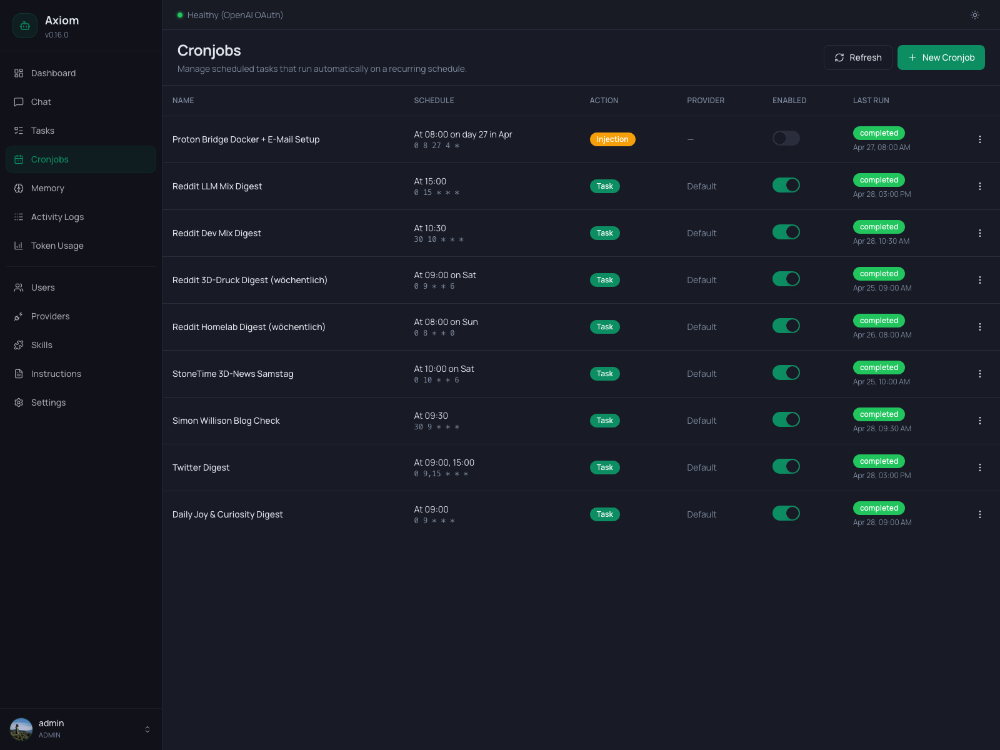

# Cronjobs

The Cronjobs page is where you manage everything that runs on a schedule — daily summaries, weekly digests, periodic checks, one-shot reminders. Each row is one entry in the `scheduled_tasks` table; firing a cronjob either spawns a full task agent or injects a static message into the chat, depending on its action type.

> **Admin only.** Regular users don't see this page.

> **What is a cronjob?** This page is about *operating* cronjobs. For the architecture — how the scheduler works, the 5-field cron grammar, auto-disable for one-shot patterns, the 55-second deduplication cooldown, the 5-second past-due grace, and why reminders are a separate tool — see [Tasks & Cronjobs concept](../concepts/tasks-and-cronjobs).

## List view

The page is a single table — one row per scheduled cronjob. There is no filter toolbar; the list is small enough that you scan it directly.

### Header actions

Two buttons in the page header:

- **Refresh** — re-fetches `/api/cronjobs`. The list does *not* auto-poll, so click this to pull in fresh `Last Run` info after a fire.
- **New Cronjob** — opens the create dialog (see [Create / Edit dialog](#create-edit-dialog) below).

### Columns

| Column        | Notes                                                                                              |
|---------------|----------------------------------------------------------------------------------------------------|
| **Name**      | The cronjob name, plus inline badges for any customizations (see [Name badges](#name-badges)).    |
| **Schedule**  | Top line: human-readable (e.g. *"At 09:00 on Sat"*). Bottom line: the raw 5-field cron expression. |
| **Action**    | `Task` (green) or `Injection` (amber). See [Action types](#action-types).                          |
| **Provider**  | `Default` (uses [Settings → Tasks](../settings/tasks)), a specific `Provider (model)`, or `—` for injections (no agent runs). |
| **Enabled**   | A live toggle. Flipping it pauses or resumes the cronjob without deleting it.                     |
| **Last Run**  | Status badge (`completed` / `failed` / `running`) plus the local timestamp of the last firing. `—` if never fired. |
| **⋮**         | Row menu — Edit, Run Now, Delete.                                                                  |

Clicking anywhere else on a row opens the same edit dialog as the menu's *Edit* item.

### Name badges

Customizations show up as small outline badges next to the cronjob name so you can see at a glance which entries deviate from the defaults:

- **`custom tools`** — the cronjob has tool overrides (some tools disabled for this run).
- **`custom skills`** — the cronjob has skill overrides (some skills disabled for this run).
- **`custom prompt`** — the cronjob has a custom system prompt that completely replaces the default task agent system prompt.
- **📎 `<skill-name>`** — one badge per attached skill. Attached skills get their `SKILL.md` injected directly into the task prompt on every firing. See [Tasks & Cronjobs → `attached_skills`](../concepts/tasks-and-cronjobs#attached-skills).

A row with no badges runs on the unmodified defaults.

### Action types

The Action column distinguishes the two cronjob flavors:

| Badge       | Meaning                                                                                          |
|-------------|--------------------------------------------------------------------------------------------------|
| `Task`      | Each firing spawns a full task agent with the configured prompt, tools, and skills. Use for anything that needs to think, fetch data, or run tools. |
| `Injection` | Each firing inserts the configured prompt verbatim into the parent chat as a system message. No agent runs. Used for static periodic notifications and reminders. |

Reminders created via the agent's `create_reminder` tool show up here with action type `Injection` — internally they're just cronjobs with a tighter contract. See [Tasks & Cronjobs → Reminders](../concepts/tasks-and-cronjobs#reminders).

### Enabled toggle

The switch in the Enabled column flips `enabled` on the database row immediately. Disabled cronjobs stay in the list (greyed switch) but the scheduler skips them. There is no confirmation dialog — toggling is meant to be a quick, reversible action.

> **Auto-disable.** Some cronjobs disable themselves after firing. If a cron expression matches a single point in time more than 364 days in the future (e.g. `30 11 30 3 *` = March 30 at 11:30, fired by `create_reminder`), the scheduler auto-disables the row after the first run so it doesn't fire again next year. `Task`-type cronjobs are never auto-disabled.

### Row menu (⋮)

| Item          | What it does                                                                                       |
|---------------|----------------------------------------------------------------------------------------------------|
| **Edit**      | Opens the [Create / Edit dialog](#create-edit-dialog) prefilled with the current cronjob.         |
| **Run Now**   | Fires the cronjob immediately, ignoring its schedule. Returns a success banner with the cronjob name. |
| **Delete**    | Destructive — opens a confirmation dialog before removing the row.                                 |

**Run Now** uses the same code path as a scheduled firing: `Task` cronjobs spawn a fresh task (visible in the [Tasks](./tasks) page with trigger `cronjob`); `Injection` cronjobs deliver their message into the parent chat right away. Useful for testing a cronjob's prompt without waiting for the next scheduled tick.

### Empty state

When you have no cronjobs at all, the table is replaced by a centered message — *"No scheduled tasks. Create a cronjob to automate recurring tasks like daily summaries or periodic checks."* — with a `New Cronjob` button right there.

## Create / Edit dialog

Both **New Cronjob** and the row's *Edit* item open the same modal dialog. The form is split into three sections: **basics**, **provider** (Task only), and a collapsible **Advanced Configuration** block (Task only).

### Basics

| Field           | Notes                                                                                              |
|-----------------|----------------------------------------------------------------------------------------------------|
| **Name**        | Required. Free text. Shown in the list, in `<task_injection>` blocks, and on the Tasks detail view. |
| **Prompt**      | Required. For `Task`: what the task agent should do on each firing. For `Injection`: the literal text to insert into chat. |
| **Schedule**    | Required. 5-field cron expression — `minute hour day-of-month month day-of-week`. Examples: `0 9 * * *` (daily at 9:00), `*/15 * * * *` (every 15 min), `30 14 * * 1-5` (weekdays at 14:30). |
| **Action Type** | `Task (full agent)` or `Injection (lightweight)`. Switching to *Injection* hides the provider and Advanced Configuration sections — they don't apply. |

Schedules are evaluated in the timezone configured under [Settings → Agent](../settings/agent#timezone). Changing the timezone reinterprets every enabled cronjob on the next tick.

### Provider

Only visible when **Action Type** is `Task`. Pick:

- **Default provider** — uses whatever is configured under [Settings → Tasks](../settings/tasks). When you later change the default, this cronjob picks it up automatically.
- A specific `Provider (model)` pairing — pins the cronjob to that exact provider/model combination regardless of any future default changes.

Each entry expands every provider's *enabled* models into its own option, so the same provider can appear multiple times for different models.

### Advanced Configuration

Collapsible section, only available for `Task`-type cronjobs. The header carries a `customized` badge whenever any override is set, so you can tell at a glance whether to expand it.

It bundles four overrides:

#### Tool Overrides

A switch for every tool in the agent's tool registry. By default every tool is enabled — flipping a switch off excludes that tool for this cronjob's firings. Newly added tools (after a code update) default to enabled, so disabling here is allowlist-by-exception.

If a previously disabled tool no longer exists (e.g. it was renamed or removed), it shows up below the live list with strike-through styling so you can clean up the dead override.

#### Skill Overrides

Same pattern, but for installed skills. Each row shows the skill's emoji, display name, and ID. Disabled skills stay out of the cronjob's `<available_skills>` list. As with tools, stale entries appear crossed out so you can remove them.

#### Attached Skills

Different mechanism — these get *baked into the prompt*. For every selected skill (both **agent** skills under `/data/skills_agent/<name>/` and **installed** user skills), the runner reads its `SKILL.md` and prepends it to the spawned task's system prompt under an `<attached_skills>` block.

This is the deterministic alternative to relying on the agent's routing decision: when a cronjob's reliability depends on a skill (e.g. a daily Nitter scrape that needs the `nitter` skill's URL conventions), attaching it guarantees the rules are in the prompt every time.

A small tag next to each skill name marks it as either `agent` or `installed`. Selected skills also appear as a 📎 badge row at the bottom of the section, mirroring how they show up in the list view.

See [Tasks & Cronjobs → `attached_skills`](../concepts/tasks-and-cronjobs#attached-skills) for the full mechanics.

#### System Prompt Override

A free-text textarea. When set, it **completely replaces** the default task agent system prompt — including the `STATUS / SUMMARY` final-message contract, the `/workspace` pointer, and everything in `<task_system>`. Leave empty to use the default.

Use sparingly. The defaults exist for a reason; the most common use case is a cronjob that needs a very different persona or output format than a normal task agent.

### Submitting

The footer has **Cancel** and **Create** / **Save** (depending on mode). The button shows `Saving…` while the request is in flight; on success the dialog closes and the list reflects the change immediately.

## Delete confirmation

Selecting *Delete* from the row menu opens a `ConfirmDialog`:

> **Delete cronjob?** This will permanently remove the scheduled task. Any running instances will not be affected.

The destructive *Delete* button is styled red. Confirming removes the `scheduled_tasks` row and cancels the in-memory timer. Tasks that were already spawned by this cronjob in the past stay visible in the [Tasks](./tasks) page — only the schedule itself is gone.

## See also

- [Tasks & Cronjobs concept](../concepts/tasks-and-cronjobs) — scheduler internals, cron grammar, action types, reminders, attached skills, the OS-scheduler safety rule.
- [Settings → Tasks](../settings/tasks) — defaults that apply to every `Task`-type cronjob (provider, max duration, loop detection, telegram delivery, status updates, background thinking level).
- [Settings → Agent](../settings/agent) — timezone, which controls how cron expressions are interpreted.
- [Tasks](./tasks) — every `Task`-type firing creates a row there with trigger `cronjob`.
