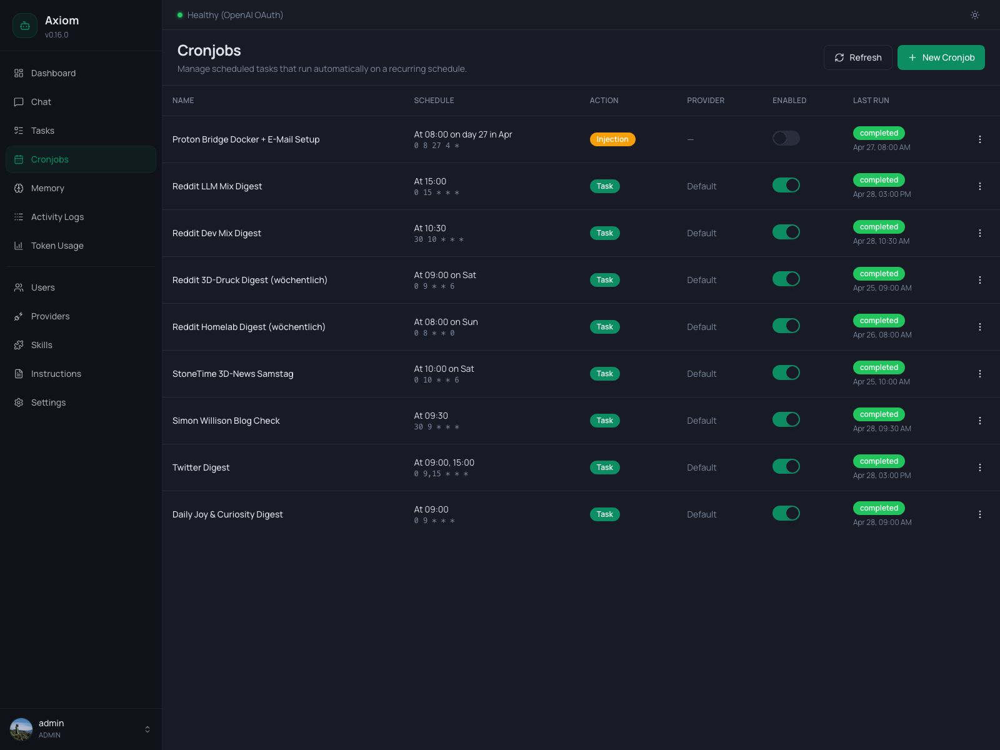

# Cronjobs

The Cronjobs page is where you manage everything that runs on a schedule — daily summaries, weekly digests, periodic checks, one-shot reminders. Each row is one entry in the `scheduled_tasks` table; firing a cronjob either spawns a full task agent or injects a static message into the chat, depending on its action type.

> **Admin only.** Regular users don't see this page.

> **What is a cronjob?** This page is about *operating* cronjobs. For the architecture — how the scheduler works, the 5-field cron grammar, auto-disable for one-shot patterns, the 55-second deduplication cooldown, the 5-second past-due grace, and why reminders are a separate tool — see [Tasks & Cronjobs concept](../concepts/tasks-and-cronjobs).

## List view

The page is a filter toolbar above a list of scheduled cronjobs: a table on desktop, a stack of cards on mobile (see [Mobile layout](#mobile-layout)).

### Header actions

A single button in the page header:

- **New Cronjob** opens the create dialog (see [Create / Edit dialog](#create-edit-dialog) below).

The **Refresh** button sits at the right end of the [filter toolbar](#filter-toolbar), not in the header.

### Filter toolbar

Six filters sit at the top, plus a Refresh button. They combine with AND semantics: pick an action type *and* a provider *and* a last-run status to narrow down. Filtering happens client-side on the already-loaded list, so it is instant.

| Filter              | Options                                                                                          |
|---------------------|--------------------------------------------------------------------------------------------------|
| **Search**          | Free text. Matches against the cronjob name, the prompt, and the names of attached skills (case-insensitive). |
| **Enabled state**   | All states, Enabled only, Disabled only. **Defaults to Enabled only.**                            |
| **Action type**     | All actions, Task, Injection.                                                                    |
| **Provider**        | All providers, *Default*, or a specific `Provider (model)` pairing. Only matches `Task` cronjobs; injections never match a provider filter. |
| **Last run status** | All last runs, Running, Completed, Failed, Never ran.                                            |
| **Schedule type**   | All schedules, Recurring, Fixed date.                                                            |
| **Refresh**         | Re-fetches `/api/cronjobs`. The list does *not* auto-poll, so click this to pull in fresh `Last Run` info after a fire. |

A few details worth knowing:

- **Enabled state defaults to `Enabled only`.** Disabled cronjobs are hidden when the page loads. Switch the filter to `All states` or `Disabled only` to see them. Because this is the default, it does not count as an active filter (see the mobile badge below).
- The **Provider** dropdown is built from the data, not from the configured-providers list: it only offers providers that some `Task` cronjob actually uses. The `Default` entry appears only if at least one `Task` cronjob runs on the [task default](../settings/tasks), and it selects exactly those.
- **Never ran** matches cronjobs that have no `Last Run` timestamp yet.
- **Schedule type** is derived from the cron expression. `Fixed date` means both the day-of-month and month fields are fixed numbers (e.g. `30 11 30 3 *`), so the schedule fires on specific calendar dates at most once a year. That is the shape `create_reminder` produces for one-shot reminders. Everything else is `Recurring`.

### Columns

| Column        | Notes                                                                                              |
|---------------|----------------------------------------------------------------------------------------------------|
| **Name**      | The cronjob name, plus badges for any customizations (see [Name badges](#name-badges)).           |
| **Schedule**  | Top line: human-readable (e.g. *"At 09:00 on Sat"*). Bottom line: the raw 5-field cron expression. |
| **Action**    | `Task` (green) or `Injection` (amber). See [Action types](#action-types).                          |
| **Provider**  | `Default` (uses [Settings → Tasks](../settings/tasks)), a specific `Provider (model)`, or `—` for injections (no agent runs). |
| **Enabled**   | A live toggle. Flipping it pauses or resumes the cronjob without deleting it.                     |
| **Last Run**  | Status badge (`completed` / `failed` / `running`) plus the local timestamp of the last firing. `—` if never fired. |
| **⋮**         | Row menu — Edit, Run Now, Delete.                                                                  |

Clicking anywhere else on a row opens the same edit dialog as the menu's *Edit* item.

### Name badges

Customizations show up as small badges in the Name cell so you can see at a glance which entries deviate from the defaults. Override badges sit inline next to the name; attached-skill badges get their own line below it.

Inline, next to the name (outline style):

- **`custom tools`**: the cronjob has tool overrides (some tools disabled for this run).
- **`custom skills`**: the cronjob has skill overrides (some skills disabled for this run).
- **`custom prompt`**: the cronjob has a custom system prompt that completely replaces the default task agent system prompt.

On a second line below the name (secondary style):

- **📎 `<skill-name>`**: one badge per attached skill. Attached skills get their `SKILL.md` injected directly into the task prompt on every firing. Hover a badge for a tooltip naming the skill. See [Tasks & Cronjobs → `attached_skills`](../concepts/tasks-and-cronjobs#attached-skills).

A row with no badges runs on the unmodified defaults. On mobile, all badges (overrides and attached skills) share a single wrapping row below the name.

### Mobile layout

Below the `md` breakpoint the table is replaced by a vertical stack of cards, one per cronjob. Each card contains the same information as a table row, rearranged:

- **Top row**: cronjob name, the `Task` / `Injection` badge, and the ⋮ menu (Edit, Run Now, Delete).
- **Badge row**: override badges and 📎 attached-skill badges, only shown if the cronjob has any.
- **Schedule**: human-readable text with the raw cron expression underneath, next to a **Last Run** block with status badge and timestamp (or `—` if never fired).
- **Bottom row**: the **Provider** label (Task cronjobs only) and the **Enabled** switch.

Tapping anywhere on the card opens the edit dialog, the same as clicking a table row. The switch and the ⋮ menu are exempt from that, so toggling or opening the menu does not open the dialog.

The filter toolbar collapses into a **Filters** button that opens a popover with all six fields, plus a compact Refresh icon button next to it. The Filters button shows a count badge when any filter differs from its default. Since `Enabled only` *is* the default, that filter alone does not produce a badge.

### Action types

The Action column distinguishes the two cronjob flavors:

| Badge       | Meaning                                                                                          |
|-------------|--------------------------------------------------------------------------------------------------|
| `Task`      | Each firing spawns a full task agent with the configured prompt, tools, and skills. Use for anything that needs to think, fetch data, or run tools. |
| `Injection` | Each firing inserts the configured prompt verbatim into the parent chat as a system message. No agent runs. Used for static periodic notifications and reminders. |

Reminders created via the agent's `create_reminder` tool show up here with action type `Injection` — internally they're just cronjobs with a tighter contract. See [Tasks & Cronjobs → Reminders](../concepts/tasks-and-cronjobs#reminders).

### Enabled toggle

The switch in the Enabled column (or on the card, on mobile) flips `enabled` on the database row immediately. The scheduler skips disabled cronjobs. There is no confirmation dialog: toggling is meant to be a quick, reversible action.

Note that the [Enabled state filter](#filter-toolbar) defaults to `Enabled only`, so a cronjob you just switched off disappears from the list. It is not deleted. Set the filter to `All states` or `Disabled only` to find it again and switch it back on.

> **Auto-disable.** Some cronjobs disable themselves after firing. If a cron expression matches a single point in time more than 364 days in the future (e.g. `30 11 30 3 *` = March 30 at 11:30, fired by `create_reminder`), the scheduler auto-disables the row after the first run so it doesn't fire again next year. `Task`-type cronjobs are never auto-disabled.

### Row menu (⋮)

| Item          | What it does                                                                                       |
|---------------|----------------------------------------------------------------------------------------------------|
| **Edit**      | Opens the [Create / Edit dialog](#create-edit-dialog) prefilled with the current cronjob.         |
| **Run Now**   | Fires the cronjob immediately, ignoring its schedule. Returns a success banner with the cronjob name. |
| **Delete**    | Destructive — opens a confirmation dialog before removing the row.                                 |

**Run Now** uses the same code path as a scheduled firing: `Task` cronjobs spawn a fresh task (visible in the [Tasks](./tasks) page with trigger `cronjob`); `Injection` cronjobs deliver their message into the parent chat right away. Useful for testing a cronjob's prompt without waiting for the next scheduled tick.

### Empty state

There are two distinct empty states:

- **No cronjobs at all.** The list is replaced by a centered message, *"No scheduled tasks. Create a cronjob to automate recurring tasks like daily summaries or periodic checks."*, with a `New Cronjob` button right there.
- **No filter matches.** You have cronjobs, but none pass the current filters. The message reads *"No cronjobs match the filters. Adjust or reset the filters to see more cronjobs."* and offers a **Reset filters** button that restores every filter to its default, including `Enabled only` for the enabled state.

Because the enabled filter defaults to `Enabled only`, a fresh install whose only cronjobs are disabled shows the *no filter matches* state, not the *no cronjobs* one.

## Create / Edit dialog

Both **New Cronjob** and the row's *Edit* item open the same modal dialog. The form is split into three sections: **basics**, **provider** (Task only), and a collapsible **Advanced Configuration** block (Task only).

### Basics

| Field           | Notes                                                                                              |
|-----------------|----------------------------------------------------------------------------------------------------|
| **Name**        | Required. Free text. Shown in the list, in `<task_injection>` blocks, and on the Tasks detail view. |
| **Prompt**      | Required. For `Task`: what the task agent should do on each firing. For `Injection`: the literal text to insert into chat. |
| **Schedule**    | Required. 5-field cron expression — `minute hour day-of-month month day-of-week`. Examples: `0 9 * * *` (daily at 9:00), `*/15 * * * *` (every 15 min), `30 14 * * 1-5` (weekdays at 14:30). |
| **Action Type** | `Task (full agent)` or `Injection (lightweight)`. Switching to *Injection* hides the provider and Advanced Configuration sections — they don't apply. |

Schedules are evaluated in the timezone configured under [Settings → Agent](../settings/agent#timezone). Changing the timezone reinterprets every enabled cronjob on the next tick.

### Provider

Only visible when **Action Type** is `Task`. Pick:

- **Default provider** — uses whatever is configured under [Settings → Tasks](../settings/tasks). When you later change the default, this cronjob picks it up automatically.
- A specific `Provider (model)` pairing — pins the cronjob to that exact provider/model combination regardless of any future default changes.

Each entry expands every provider's *enabled* models into its own option, so the same provider can appear multiple times for different models.

### Advanced Configuration

Collapsible section, only available for `Task`-type cronjobs. The header carries a `customized` badge whenever any override is set, so you can tell at a glance whether to expand it.

It bundles four overrides:

#### Tool Overrides

A switch for every tool in the agent's tool registry. By default every tool is enabled — flipping a switch off excludes that tool for this cronjob's firings. Newly added tools (after a code update) default to enabled, so disabling here is allowlist-by-exception.

If a previously disabled tool no longer exists (e.g. it was renamed or removed), it shows up below the live list with strike-through styling so you can clean up the dead override.

#### Skill Overrides

Same pattern, but for installed skills. Each row shows the skill's emoji, display name, and ID. Disabled skills stay out of the cronjob's `<available_skills>` list. As with tools, stale entries appear crossed out so you can remove them.

#### Attached Skills

Different mechanism — these get *baked into the prompt*. For every selected skill (both **agent** skills under `/data/skills_agent/<name>/` and **installed** user skills), the runner reads its `SKILL.md` and prepends it to the spawned task's system prompt under an `<attached_skills>` block.

This is the deterministic alternative to relying on the agent's routing decision: when a cronjob's reliability depends on a skill (e.g. a daily Nitter scrape that needs the `nitter` skill's URL conventions), attaching it guarantees the rules are in the prompt every time.

A small tag next to each skill name marks it as either `agent` or `installed`. Selected skills also appear as a 📎 badge row at the bottom of the section, mirroring how they show up in the list view.

See [Tasks & Cronjobs → `attached_skills`](../concepts/tasks-and-cronjobs#attached-skills) for the full mechanics.

#### System Prompt Override

A free-text textarea. When set, it **completely replaces** the default task agent system prompt — including the `STATUS / SUMMARY` final-message contract, the `/workspace` pointer, and everything in `<task_system>`. Leave empty to use the default.

Use sparingly. The defaults exist for a reason; the most common use case is a cronjob that needs a very different persona or output format than a normal task agent.

### Submitting

The footer has **Cancel** and **Create** / **Save** (depending on mode). The button shows `Saving…` while the request is in flight; on success the dialog closes and the list reflects the change immediately.

## Delete confirmation

Selecting *Delete* from the row menu opens a `ConfirmDialog`:

> **Delete cronjob?** This will permanently remove the scheduled task. Any running instances will not be affected.

The destructive *Delete* button is styled red. Confirming removes the `scheduled_tasks` row and cancels the in-memory timer. Tasks that were already spawned by this cronjob in the past stay visible in the [Tasks](./tasks) page — only the schedule itself is gone.

## See also

- [Tasks & Cronjobs concept](../concepts/tasks-and-cronjobs) — scheduler internals, cron grammar, action types, reminders, attached skills, the OS-scheduler safety rule.
- [Settings → Tasks](../settings/tasks) — defaults that apply to every `Task`-type cronjob (provider, max duration, loop detection, telegram delivery, status updates, background thinking level).
- [Settings → Agent](../settings/agent) — timezone, which controls how cron expressions are interpreted.
- [Tasks](./tasks) — every `Task`-type firing creates a row there with trigger `cronjob`.
