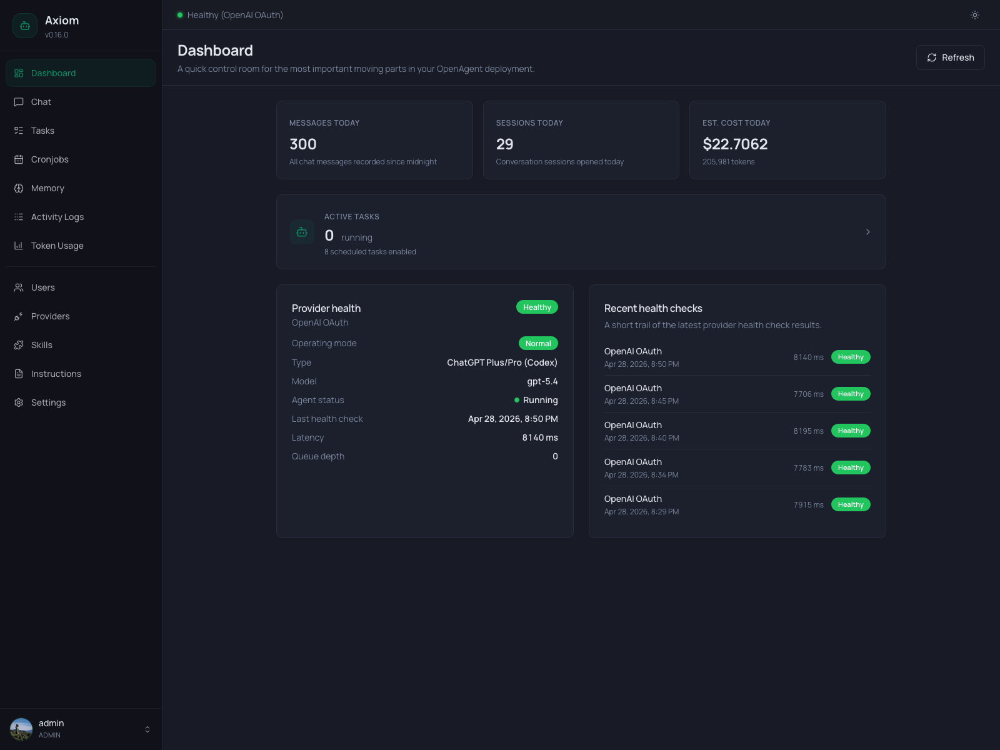

# Dashboard

The Dashboard is the operations overview — a single screen that answers *"is everything healthy, and what's happening today?"*.

> **Admin only.** Regular users see a locked screen. The metrics here aggregate across all users and sessions, so they're scoped to operators.

## Refresh

The header has a single `Refresh` button. The page does not auto-poll — every load and every click of `Refresh` re-fetches all six underlying endpoints in parallel:

- `/api/health` — current provider/agent state.
- `/api/health/history?limit=5` — last five health checks.
- `/api/providers` — number of configured providers.
- `/api/stats/summary` — token totals for today.
- `/api/tasks?status=running` — count of running tasks.
- `/api/cronjobs` — count of enabled cronjobs.

If any one of them fails, an error banner appears at the top of the page and the rest of the data still renders.

## KPI row

Three cards sit at the top, each showing one number that resets at midnight (server timezone, see [Settings → Agent](../settings/agent)):

| Card                    | Number                                                              |
|-------------------------|---------------------------------------------------------------------|
| **Messages today**      | Total chat messages recorded since 00:00 — both directions.         |
| **Sessions today**      | Number of distinct conversation sessions opened today.              |
| **Est. cost today**     | Estimated USD cost based on `tokenPriceTable` from `settings.json`. |

The cost card additionally shows the underlying total token count below the value. If your provider isn't in `tokenPriceTable`, this number stays at `$0.00` — see [`settings.json` Reference](../reference/settings) for how to add prices.

## Active Tasks card

A wide card below the KPI row links to the [Tasks](./tasks) page. It shows:

- **Running** — how many tasks are currently in `running` state.
- **Scheduled** — how many cronjobs have `enabled = true`.

Click anywhere on the card to jump to the Tasks list filtered to running tasks.

## Provider health

The left half of the bottom row shows the active provider, its current health, and the agent process state. This card is only rendered when the **Health Monitor** is enabled (see [Settings → Health Monitor](../settings/health-monitor) — if you've turned it off, the whole bottom row disappears).

The card layout adapts to the current **operating mode**:

### Normal mode

When the configured provider is healthy, you see:

- **Operating mode** — `Normal` (green badge).
- **Provider type / Model** — e.g. `OpenAI / gpt-5.1`.
- **Agent status** — `Running` or `Stopped`. Dot turns green when running.
- **Last health check** — timestamp of the most recent check.
- **Latency** — round-trip latency of that last check, in milliseconds.
- **Queue depth** — number of in-flight requests the agent is currently handling.

The status badge in the card header reflects the provider state: `Healthy`, `Degraded`, `Down`, or `Unconfigured`.

### Fallback mode

When the primary provider is failing and the Health Monitor has switched over, three extra rows appear:

- **Fallback provider** — name and model that's currently answering.
- **Primary provider** — its last known health status (`Down`, `Degraded`).
- **Recovery** — *"Recovery checks running…"*. The Health Monitor keeps probing the primary so it can switch back automatically.

The operating-mode badge turns amber so the fallback state is visible at a glance.

If the most recent health check produced an error message, it's shown in a red `Alert` at the bottom of the card.

## Recent health checks

The right half of the bottom row lists the last five health checks (timestamp, provider, status, latency). New entries arrive on the next `Refresh` — there is no live tailing here. For a deeper history, jump to [Activity Logs](./activity-logs) or look at the database directly.

If health monitoring has never run (e.g. fresh install), the list shows an empty state.

## What's not on the Dashboard

A few things you might expect here live elsewhere:

- **Per-provider cost breakdown** → [Token Usage](./token-usage).
- **Tool call history** → [Activity Logs](./activity-logs).
- **Failed tasks** → filter the [Tasks](./tasks) page by status `Failed`.
- **Memory state** → [Memory](./memory).

The Dashboard is intentionally a one-screen summary. Everything that needs scrolling, filtering, or editing has a dedicated page.

## See also

- [Settings → Health Monitor](../settings/health-monitor) — check interval, fallback rules, notifications.
- [Settings → Agent](../settings/agent) — active provider/model, language, timezone.
- [Tasks](./tasks) — for the full task list behind the *Active Tasks* card.
