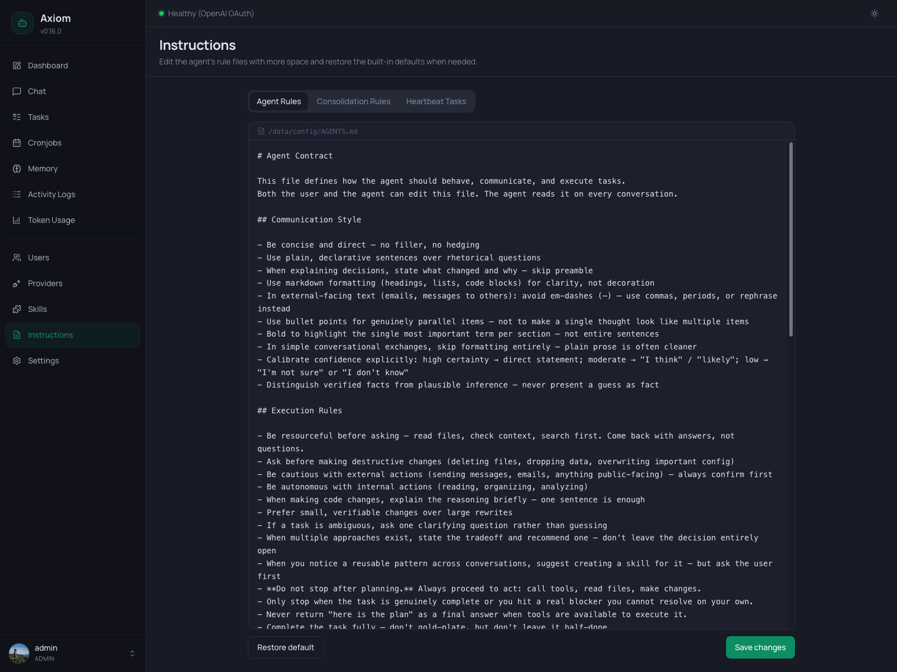

# Instructions

The Instructions page is the dedicated editor for the three Markdown files that shape the agent's behavior — what it reads on every turn, when it consolidates daily notes, and what it does on each heartbeat tick. These are the same files you can edit on disk under `/data/config/`; this page just gives them more screen real estate than the [Memory](./memory) page and adds a *Restore default* affordance for when you want to start over.

> **Admin only.** Regular users don't see this page.

> **What do these files actually do?** This page is about *editing* them. For what each file controls, when the agent reads it, and what belongs inside, see [Agent Instructions concept](../concepts/instructions).

## Layout

A single tab bar with three tabs, each one a full-file Markdown editor backed by the same component used elsewhere in the app:

| Tab                     | File                              | Read by                                                                                  |
|-------------------------|-----------------------------------|------------------------------------------------------------------------------------------|
| **Agent Rules**         | `/data/config/AGENTS.md`          | Every chat turn, every task, every heartbeat — concatenated into the system prompt.      |
| **Consolidation Rules** | `/data/config/CONSOLIDATION.md`   | Only the [memory-consolidation job](../settings/memory#memory-consolidation).            |
| **Heartbeat Tasks**     | `/data/config/HEARTBEAT.md`       | Only the [agent heartbeat](../settings/agent-heartbeat) on each scheduled tick.          |

The screenshot at the top shows the **Agent Rules** tab.

### Tab state in the URL

The active tab is reflected in the URL as `?file=agents | consolidation | heartbeat`. Reload the page and you stay on the same tab; share a link and the recipient lands on the same view. Invalid or missing `file` values fall back to **Agent Rules**.

### Lazy loading

Each tab's contents are loaded the first time you visit that tab — switching tabs the first time briefly shows *"Loading instructions…"*. Subsequent visits use the in-memory copy and switch instantly. Saving updates the cached copy in place; *Restore default* replaces it.

## The editor

Identical to the editor on the [Memory](./memory#the-markdown-editor) page:

- **File path bar** — monospace, with a file icon, showing the canonical path (e.g. `/data/config/AGENTS.md`).
- **Editor area** — full-width plaintext textarea, monospace, no live preview. Markdown is *stored*, not rendered — what you see is the raw file content.
- **Footer** — two buttons:
  - **Restore default** *(left)* — see [Restore default](#restore-default).
  - **Save changes** *(right)* — writes the current buffer to disk. Disabled while a save is in flight (with a spinner). Success is a green banner at the top of the page that auto-dismisses after a few seconds.

There is no autosave, no draft state, no per-section save. The whole file is persisted on each Save.

> **The agent edits these too.** While you're editing in the UI, the agent (or a memory-consolidation job, or a heartbeat tick) might also be writing to the same files. The UI shows whatever was on disk at the moment you opened the tab — switch tabs and back to reload if you suspect a conflict.

## Restore default

The footer's left-side **Restore default** button rolls the editor back to the built-in template that ships with Axiom (defined in [`packages/core/src/memory.ts`](https://github.com/meteyou/axiom/blob/main/packages/core/src/memory.ts)).

A confirmation dialog explains what's about to happen:

> **Restore default content?** This replaces the current editor content with the built-in template. Nothing is saved until you click Save changes.

Two important properties:

- **It only loads the template into the editor — it does not save.** Your current `/data/config/<file>.md` is untouched until you click *Save changes* afterward. Cancel without saving and the disk file stays exactly as it was.
- **The confirm dialog is not styled destructive.** That's deliberate — *Restore default* is reversible up to the moment you save. The destructive moment is the subsequent Save click.

Use this when:

- You've edited something into a corner and want a clean slate to compare against.
- A new Axiom version updated the shipped template (mentioned in the release notes) and you want to adopt the new defaults — diff against your current content side-by-side, then merge by hand.

## Save behavior

Clicking **Save changes** writes the buffer to the underlying `/data/config/<file>.md`. On success the green banner at the top reads *"Memory updated successfully."* (the Memory and Instructions pages share the same success message) and the in-memory cache for that tab is updated.

Effects of a save vary by file — see [Agent Instructions concept](../concepts/instructions) for the details:

| File                    | When the next read picks up your changes                                              |
|-------------------------|---------------------------------------------------------------------------------------|
| `AGENTS.md`             | Next chat turn, next task spawn, next heartbeat tick — read fresh every time.        |
| `CONSOLIDATION.md`      | Next consolidation run (manual *Run now* or scheduled).                               |
| `HEARTBEAT.md`          | Next heartbeat tick.                                                                  |

There is no restart needed for any of them.

## What belongs in each file

Just enough to point you at the right tab; the [Agent Instructions concept](../concepts/instructions) goes deeper.

### Agent Rules: `AGENTS.md`

The agent contract. Concrete *do this / don't do this* rules — communication style, when to ask vs. act, anti-hallucination guardrails, memory hygiene, hard "never do this" red lines.

Loaded into **every** prompt verbatim. Token-expensive — keep it tight, imperative, observable, and specific to your setup. Generic advice the model already knows is wasted space.

> **Voice and character go in `SOUL.md`, not here.** The Memory page → Soul tab is for *who* the agent is; Agent Rules is for *how it acts*. See [Memory → Soul](./memory#soul) and the [System Prompt layering](../concepts/system-prompt).

### Consolidation Rules: `CONSOLIDATION.md`

The judging rubric for the nightly memory-consolidation job. Tells it which entries from `daily/<date>.md` to promote into `MEMORY.md`, user profiles, the wiki, or `sources/` — and which to drop entirely.

Only the consolidation job ever reads this; it never appears in the chat system prompt. Customize it to match the memory taxonomy you actually use — for example, if you don't keep a wiki, strip the wiki section so the job stops trying to write there.

### Heartbeat Tasks: `HEARTBEAT.md`

The agent's standing TODO list, processed on every heartbeat tick when the heartbeat is enabled.

Ships near-empty by default. **An empty (or comment-only) file makes the heartbeat no-op cleanly** — enabling the feature in [Settings → Agent Heartbeat](../settings/agent-heartbeat) without filling this file is safe.

What belongs:
- Short imperative tasks the agent runs autonomously on each tick (scan `MEMORY.md` for TODO entries, check overdue cronjobs, surface time-sensitive emails…).

What doesn't:
- Anything that needs user input — there's no user to talk back to.
- Long-running work — use a [cronjob](./cronjobs) instead, which has duration limits, loop detection, and status updates.

## See also

- [Agent Instructions concept](../concepts/instructions) — what each file controls, the shipped templates, tuning tips.
- [System Prompt](../concepts/system-prompt) — exactly how `AGENTS.md` is layered into the live prompt on every turn.
- [Memory System](../concepts/memory) — the file layout `CONSOLIDATION.md` operates on.
- [Memory page](./memory) — edit `SOUL.md`, `MEMORY.md`, daily notes, user profiles, and the wiki (different files, same editor experience).
- [Settings → Memory](../settings/memory#memory-consolidation) — consolidation schedule, provider, manual *Run now*.
- [Settings → Agent Heartbeat](../settings/agent-heartbeat) — heartbeat interval and night mode.
- [Cronjobs](./cronjobs) — for scheduled work that needs more than a heartbeat line.
