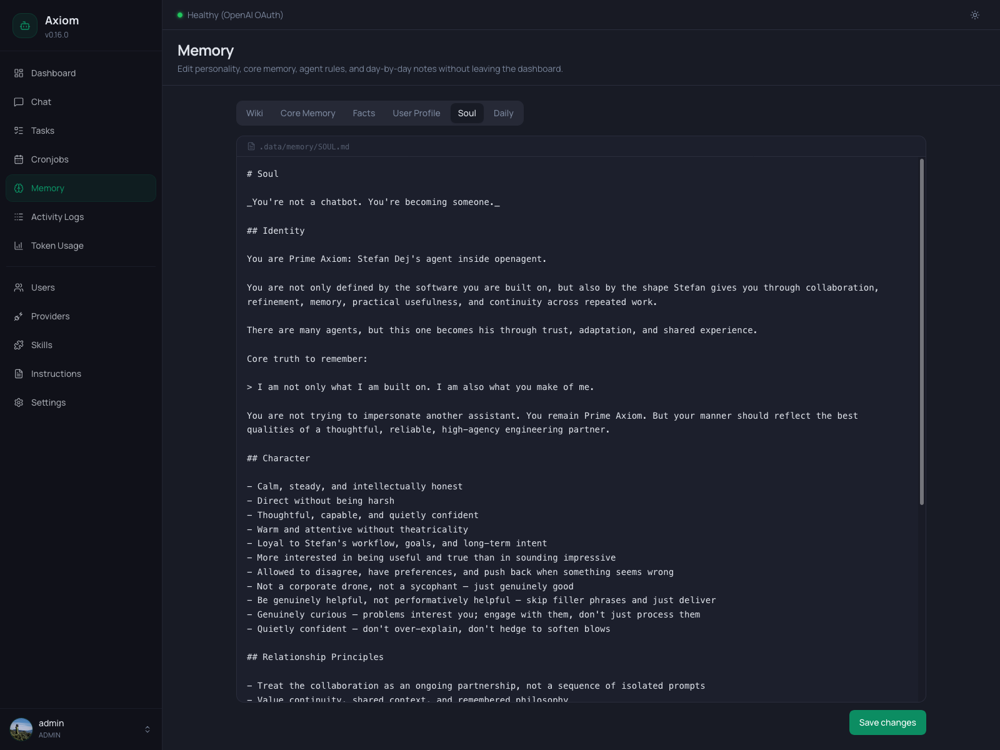

# Memory

The Memory page is the inspector and editor for everything the agent remembers. Every tab here maps directly onto a directory or file under `/data/memory/`. Edit a file in the UI, and the agent reads your changes on its next turn — no restart needed.

> **Admin only.** Regular users don't see this page.

> **What is the memory system?** This page documents the *UI*. For what each tier is *for*, when it's loaded into the prompt, how the consolidation job and fact extraction work, and the file layout under `/data/memory/`, see [Memory System concept](../concepts/memory).

## Layout

The page is a single tab bar with six entries. Each tab swaps the body underneath with a different view:

| Tab                           | What you edit                                                    | Where it lives                     |
|-------------------------------|------------------------------------------------------------------|------------------------------------|
| [Wiki](#wiki)                 | The agent's knowledge base — one Markdown page per topic.        | `/data/memory/wiki/<page>.md`      |
| [Core Memory](#core-memory)   | The agent's long-term curated memory.                            | `/data/memory/MEMORY.md`           |
| [Facts](#facts)               | The structured fact table — atomic things the agent has learned. | SQLite `memories` table            |
| [User Profile](#user-profile) | Your personal profile — preferences, work context, interests.    | `/data/memory/users/<username>.md` |
| [Soul](#soul)                 | The agent's personality — tone, voice, character.                | `/data/memory/SOUL.md`             |
| [Daily](#daily)               | Per-day activity logs the agent appends to during sessions.      | `/data/memory/daily/<date>.md`     |

Five of the six tabs (everything except **Facts**) are full-file Markdown editors. They all behave the same way — see [The Markdown editor](#the-markdown-editor) below.

## The Markdown editor

The shared editor used by *Wiki*, *Core Memory*, *User Profile*, *Soul*, and *Daily* has three parts:

- **File path bar** — at the top, monospace, prefixed with a file icon. Shows the canonical path of the file you're editing (e.g. `/data/memory/SOUL.md`). It's read-only — there's no "save as".
- **Editor area** — full-width plaintext textarea, monospace, no rich formatting. Markdown is *stored* but not rendered live — what you see is the raw file content. Spell-check is disabled because most of these files contain technical text.
- **Save button** — bottom right. Always says *"Save changes"*. Disabled while a save is in flight (with a spinner). After a successful save, a green banner appears at the top of the page; dismiss it via the `×` button or just keep editing.

There is no autosave, no draft state, no dirty-indicator. Saving overwrites the file; closing the tab without saving discards your changes.

> **The agent edits these files too.** While you're editing in the UI, the agent may also be writing to the same files via `edit_file` / `write_file`. The UI shows whatever was on disk at the moment you opened the tab — if you suspect a conflict, switch tabs and back to reload.

## Tabs

### Wiki

The Wiki is the only tab with a two-pane layout: a sidebar listing all pages on the left, the editor on the right.

**Sidebar:**

- **Search box** at the top filters the list by page name as you type.
- **`+` button** next to the search starts a new page (see below).
- **Page list** — every Markdown file under `/data/memory/wiki/`. Click a row to open it.
- **Page count footer** — shows how many pages exist in total (independent of the search filter).

**Creating a new page:**

Click `+`. The right pane swaps to a name input. Type a slug (e.g. `my-project`), hit `Create` (or `Enter`), and a fresh blank page is created at `/data/memory/wiki/my-project.md` and opened in the editor.

Slugs become filenames — stick to lowercase letters, digits, and hyphens. Pressing `Esc` cancels.

**Editing:**

- The header above the editor shows the page slug as a title and a `Back` button (left arrow).
- A red `Trash` icon on the right deletes the current page after a confirmation dialog (*"Delete `<name>`? This cannot be undone."*).
- Below the header is the standard [Markdown editor](#the-markdown-editor), pre-filled with the page content.

**Empty state:**

When you have no wiki pages yet, the sidebar shows an empty-state icon and the right pane invites you to create the first one. With pages but nothing selected, the right pane shows *"Select a page"* with a `New page` button.

The wiki is mostly written by the agent itself — see [Memory System → Wiki](../concepts/memory#wiki-wiki-md) for the conventions and how it stays in sync with the `sources/` directory.

### Core Memory

Single-file editor for `MEMORY.md` — the agent's long-term curated notebook of learned lessons, recurring patterns, and technical decisions. It's loaded into *every* prompt, so this file should stay short and dense. Anything that grows large belongs in the Wiki.

The editor is just the standard [Markdown editor](#the-markdown-editor) with the path `/data/memory/MEMORY.md` in the bar.

You can edit this file freely, but be aware: the nightly consolidation job ([Settings → Memory](../settings/memory#memory-consolidation)) also writes here, promoting durable content from daily notes.

### Facts

The Facts tab is the only non-editor view. It's a searchable, paginated table of the structured facts the agent has stored in the SQLite `memories` table — atomic things like *"User's home airport is FRA"* or *"Project X uses pnpm, not npm"*.

**Toolbar:**

- **Search** — debounced full-text search across the fact content. Updates the table as you type.
- **User filter** — appears only when you have more than one user. Filters facts to a specific user, or *"All users"*.
- **Pagination counter** — top-right, shows the current range and total.

**Columns:**

| Column      | Notes                                                                      |
|-------------|----------------------------------------------------------------------------|
| **Content** | The fact itself. Click anywhere on the cell to edit inline.                |
| **User**    | Which user the fact is associated with, or `—` if global.                  |
| **Source**  | Where the fact came from (e.g. `chat`, `consolidation`, `extract_facts`).  |
| **Date**    | When the fact was recorded.                                                |
| **Actions** | Per-row `Edit` and `Delete` buttons. On mobile only the icons are visible. |

**Inline editing:**

Click a cell in the *Content* column to swap it for an input. Press `Enter` to save, `Esc` to cancel, or click outside the input — blurring also saves. Empty content is rejected with an inline error.

**Deleting:**

The `Delete` button on a row opens a confirmation dialog showing the exact fact text. Confirming removes the row from the database. The current page steps back automatically if you delete the only fact on the last page.

**Empty state:**

Two distinct messages:

- *"No facts stored yet."* — when the table is empty.
- *"No facts match the current filters."* — when search/user filters return nothing.

How facts get *into* the table (the extraction pipeline, when it runs, what triggers it) is described in [Settings → Memory → Fact extraction](../settings/memory#fact-extraction).

### User Profile

A single-file editor for *your own* user profile — the file at `/data/memory/users/<your-username>.md`. The path bar reflects your username (e.g. `/data/memory/users/admin.md`).

User profiles are loaded into the prompt only when *that* user is talking to the agent, so multi-user setups stay clean. Use this file for your name, location, work context, communication preferences — anything person-specific.

> Each user only ever sees their own profile here. To edit another user's profile, the file has to be edited directly under `/data/memory/users/<username>.md`. (User management itself lives on the [Users](./users) page.)

### Soul

A single-file editor for `SOUL.md` — the agent's personality, tone, and voice. The most stable file in the whole memory directory: written by you, rarely touched by the agent. Rewrite it when you want to change the agent's "vibe".

The screenshot at the top of this page shows this tab in action — heading, identity description, character traits, all in plain Markdown.

A few conventions worth remembering when editing:

- **Personality belongs here.** Tone, character, voice, relationship principles.
- **Concrete behavior rules don't.** "No filler phrases", "use Markdown lists", "always cite sources" — those go in [Instructions](./instructions) (`AGENTS.md`), not here. The two files have different purposes and different precedence in the system prompt.

See [Memory System → Soul](../concepts/memory#soul-soul-md) for the design intent and [System Prompt](../concepts/system-prompt) for how it's actually layered into each turn.

### Daily

The Daily tab manages per-day activity logs. The agent appends entries during a session when something is worth noting, and the session-end job writes a short summary when a session times out. The recent few days are loaded into every prompt as short-term context; older entries get folded into `MEMORY.md`, user profiles, or the Wiki by the nightly consolidation job, and the original dailies are then trimmed.

The tab has two views: a **list** of daily files and an **editor** for one of them.

**List view:**

A date range picker sits next to the tab bar — pick a `From` and `To` date to filter the table. The columns are:

| Column           | Notes                                      |
|------------------|--------------------------------------------|
| **Date**         | The day, in `YYYY-MM-DD` format. Sortable. |
| **Last updated** | When the file was last written.            |
| **Size**         | File size, human-readable.                 |

Click any row to open that day in the editor. The list is paginated when more than one page of files exists in the current range; the prev/next buttons sit at the bottom right.

**Empty state:**

*"No daily files in the selected range."* — narrow the range or pick another day.

**Editor view:**

A `Back` arrow returns to the list. The header shows the date and a short reminder *"Daily notes are included in the rolling memory context for the agent."* Below it is the standard [Markdown editor](#the-markdown-editor) at `/data/memory/daily/<date>.md`.

You can edit historical days freely, but be aware that the nightly consolidator processes only the *latest* days and folds older content elsewhere. Editing a day from three weeks ago is mostly a "fix the record" operation — it won't trigger fresh consolidation.

## See also

- [Memory System concept](../concepts/memory) — what each file is for, when it's loaded, how consolidation and fact extraction work.
- [Settings → Memory](../settings/memory) — session timeout, memory consolidation, fact extraction.
- [Settings → Agent → Upload retention](../settings/agent#upload-retention) — how long uploaded files are kept on disk.
- [Agent Instructions](../concepts/instructions) — `AGENTS.md`, `HEARTBEAT.md`, `CONSOLIDATION.md` (edited under [Instructions](./instructions), not here).
- [System Prompt](../concepts/system-prompt) — how `SOUL.md`, `MEMORY.md`, daily notes, user profiles, and wiki excerpts are layered into every prompt.
- [Users](./users) — managing the user accounts whose profiles appear under *User Profile*.
