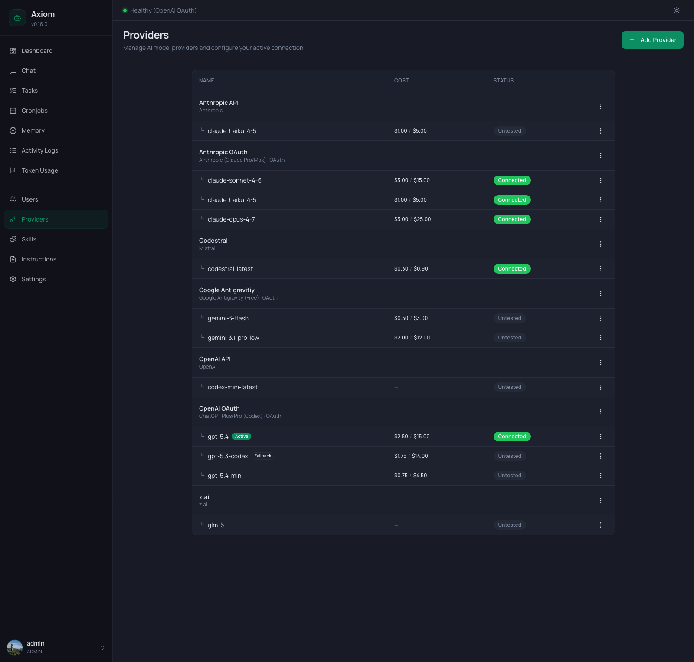

# Providers

The Providers page is where you configure which LLM endpoints Axiom can talk to — API keys, OAuth subscriptions, base URLs, model lists, costs. Every row you add here becomes selectable as the active provider for chat, the default for tasks, and the optional fallback for the Health Monitor.

> **Admin only.** Regular users don't see this page.

## Header

A single primary button on the right:

- **Add Provider** — opens the [provider form dialog](#add-edit-dialog).

There is no Refresh button — the list re-loads after every successful add / edit / delete / test.

## Two-level table

The table renders providers in **two tiers**:

- **Provider header rows** — one per configured provider. Show the display name and the underlying type (e.g. `Anthropic`, `OpenAI`, `Mistral`, `z.ai`). OAuth providers additionally show `OAuth` after the type label.
- **Model sub-rows** — one per *enabled model* on that provider, indented with `└`. Each carries its own cost, status, and per-model actions.

Providers are sorted alphabetically by display name; sub-rows follow the order configured in the provider form.

### Provider header columns

| Column      | Notes                                                                                                |
|-------------|------------------------------------------------------------------------------------------------------|
| **Name**    | Bold display name; below it, the provider type label (e.g. *"Anthropic"*, *"Anthropic (Claude Pro/Max) · OAuth"*). |
| **Cost**    | Empty — costs live on the model rows.                                                                |
| **Status**  | Empty for most providers (status lives on the model rows). For **subscription (OAuth)** providers it shows the live [subscriber usage quota](#subscriber-usage-quota-oauth-plans). |
| **⋮**       | Edit, Delete, and — for quota-capable OAuth providers — **Refresh quota**. *Delete* is disabled for the provider that owns the currently active model. |

Clicking anywhere on a header row opens the [Edit dialog](#add-edit-dialog).

### Model sub-row columns

| Column      | Notes                                                                                                |
|-------------|------------------------------------------------------------------------------------------------------|
| **Model**   | Indented model id; small badges for `Active` (green) and `Fallback` (outline). Both can appear on the same row in theory, but the active model is never also the fallback. |
| **Cost**    | `$<input>` / `$<output>` per million tokens. Shown as `—` when no cost is configured for that model. |
| **Status**  | One of `Untested`, `Connected`, `Error` — see [Statuses](#statuses).                                 |
| **⋮**       | Test Connection, Set Active, Set Fallback, Remove Fallback, Remove Model — context-aware (see [Per-model actions](#per-model-actions)). |

### Statuses

The status badge reflects the result of the **last manual test** of that specific model — *not* the live health-check state from the [Health Monitor](../settings/health-monitor).

| Badge        | Meaning                                                                                              |
|--------------|------------------------------------------------------------------------------------------------------|
| `Untested`   | Default for newly added models — no Test Connection has been run.                                    |
| `Connected`  | The last test succeeded. A green banner with the test's response time briefly appears at the top.    |
| `Error`      | The last test failed. The error message appears in a red banner at the top.                          |

While a test is running, the badge is replaced by an inline spinner with the label *"Testing…"*.

For ongoing health monitoring (latency thresholds, automatic fallback switchover), see [Settings → Health Monitor](../settings/health-monitor).

## Active vs. Fallback

Exactly one model is **active** at any time — that's the model the chat agent uses by default and the one the Dashboard shows as healthy/degraded. At most one *other* model is the **Fallback** — the Health Monitor switches to it automatically when the active provider becomes unhealthy.

- The `Active` badge in the screenshot above sits on `gpt-5.4` because that's the configured default.
- The `Fallback` badge sits on `gpt-5.3-codex` — when `gpt-5.4` goes down, the agent transparently routes to `gpt-5.3-codex` until the Health Monitor recovers the primary.

You set both from the row menu — see [Per-model actions](#per-model-actions). To change the *task* default (used by background task agents), go to [Settings → Tasks](../settings/tasks) instead — that's a separate setting.

## Per-model actions

The ⋮ menu on each model row carries up to five items, shown only when relevant:

| Item                  | When it appears                                                                  |
|-----------------------|----------------------------------------------------------------------------------|
| **Test Connection**   | Always. Sends a small request to the provider/model and updates the status badge. |
| **Set Active**        | When this model is *not* already active. Promotes it to the global active model.  |
| **Set Fallback**      | When this model is neither active nor the current fallback.                       |
| **Remove Fallback**   | Only on the current fallback model. Clears the fallback selection.                |
| **Remove Model**      | Always (but disabled in two cases — see below).                                   |

### Removing a model

`Remove Model` opens a confirmation dialog:

> **Remove model `<model>`** from provider `<provider>`? This does not uninstall the model, it only removes it from this provider's list.

Two rules guard against breaking your setup:

- **The active model can't be removed.** Switch to a different active model first, then come back.
- **The last remaining model can't be removed.** If you genuinely want to drop a provider's only model, delete the whole provider instead.

A few automatic adjustments happen on confirm:

- If you remove the model that was set as fallback, the fallback is cleared first.
- If you remove the model that was the provider's *default*, the next remaining model becomes the new default automatically — the form doesn't reopen.

## Add / Edit dialog

Opened by **Add Provider** or by clicking a provider header row. The form is small and adapts heavily to the chosen provider type.

### Common fields

The dialog keeps connection details first, then model selection, then advanced health settings:

| Field                  | Notes                                                                                                |
|------------------------|------------------------------------------------------------------------------------------------------|
| **Name**               | Free text, your label for this provider — appears in the table, in `<task_injection>` blocks, on the Dashboard. |
| **Type**               | Dropdown grouped into two sections: **API Key** (OpenAI, Anthropic, Mistral, OpenRouter, DeepSeek, Kimi / Moonshot, MiniMax, xAI (Grok), Google Gemini, OpenCode Zen, OpenCode Go, Ollama, generic OpenAI-compatible, …) and **Subscription / OAuth** (Anthropic Claude Pro/Max, OpenAI ChatGPT Plus/Pro, GitHub Copilot, …). |
| **Base URL**           | Shown directly after Type when the preset has an editable URL (Ollama, generic OpenAI-compatible, …). |
| **API Key**            | Shown after Base URL for API-key providers. Required for most hosted presets, optional for local/custom providers that do not need auth. |
| **Enabled Models**     | Model selector or model-id entry for this provider. The exact control depends on the provider type. |
| **Degraded Threshold** | Last field in the form. Latency in ms above which the provider is marked *Degraded* in health checks. Default `5000`. Lower = more sensitive. |
| **Text verbosity**     | Shown for supported OpenAI Codex/Responses-style providers. `Default` leaves the value unset so pi-ai's provider default applies; `Low`, `Medium`, `High` override response verbosity. |
| **Transport**          | Shown for the same OpenAI Codex/Responses-style providers as **Text verbosity**. Selects the wire-level streaming protocol: `Default (SSE)` leaves the value unset, `SSE`, `WebSocket`, `WebSocket (cached)`, or `Auto`. `WebSocket (cached)` keeps a persistent connection open and ships only delta context items per turn — noticeably faster on long agent sessions. Ignored (and dropped on save) for every other provider type. See [`providers.json` → Transport modes](../reference/settings#transport-modes) for the full table. |

### API-key providers

When you pick a type from the *API Key* group, the fields appear in this order:

#### Base URL

Only visible for presets where the URL is editable (Ollama, generic OpenAI-compatible, …). For Ollama the placeholder shows the default `http://localhost:11434/v1`.

#### API Key

A password field. Required for most presets, optional for ones that don't strictly need authentication (e.g. an unauthenticated local OpenAI-compatible server). In edit mode the field is empty and the hint reads *"Leave empty to keep existing key"* — only type a value if you want to replace the stored secret.

Stored encrypted at rest in `/data/config/providers.json` using `ENCRYPTION_KEY`. See [Configuration](../guide/configuration#why-encryption-key-matters).

#### Enabled Models

The model selector adapts to the preset:

- **Curated providers (OpenAI, Anthropic, Mistral, OpenRouter, DeepSeek, Kimi / Moonshot, MiniMax, xAI (Grok), OpenCode Zen, OpenCode Go, …)** — a checkbox list of known models. Tick the ones you want to enable; the first enabled becomes the provider's internal default/fallback model. OpenCode Zen and Go source their catalog (models, per-token costs, per-model API type) directly from the bundled `@earendil-works/pi-ai` registry, so they stay in sync with [OpenCode Zen](https://opencode.ai/docs/zen) whenever that dependency is updated — no manual price table to maintain.
- **Generic OpenAI-compatible** — free-text model-id entry plus an optional **Load models** button for providers that implement OpenAI's `/models` endpoint.
- **Ollama** — a separate panel with its own controls (see below).

#### Degraded Threshold

Always shown last once a provider type is selected. It controls the latency threshold used by health checks.

### Custom OpenAI-compatible providers

Pick **OpenAI-compatible (custom)** from the *API Key* group whenever you want to talk to a service that exposes the OpenAI `POST /v1/chat/completions` wire format but doesn't have a dedicated preset in Axiom — for example NVIDIA NIM (`build.nvidia.com`), self-hosted vLLM, LM Studio, llama.cpp's OpenAI server, Cloudflare AI Gateway proxies, or in-house deployments.

Unlike the curated presets, this type carries no model catalog and no fixed endpoint:

| Field              | What to enter                                                                                              |
|--------------------|------------------------------------------------------------------------------------------------------------|
| **Name**           | Any label (e.g. `NVIDIA NIM`, `Local LM Studio`).                                                          |
| **Type**           | `OpenAI-compatible (custom)`.                                                                              |
| **Base URL**       | The endpoint root that exposes `/v1/chat/completions`. Required.                                           |
| **API Key**        | Optional. Leave blank for unauthenticated local servers; paste the upstream key for hosted services.       |
| **Enabled Models** | Add one or more exact model ids the upstream API expects (e.g. `meta/llama-3.1-405b-instruct`, `qwen2.5-coder-32b`). Use **Load models** when the provider supports OpenAI's `/models` endpoint. No prefix is stripped. |
| **Degraded Threshold** | Optional latency threshold override; defaults to `5000` ms.                                           |

The provider is wired through pi-ai's `openai-completions` API, so streaming, tool-calling, and reasoning capture work the same way they do for the regular `openai` preset.

#### Example: NVIDIA NIM (`build.nvidia.com`)

1. Grab a key from <https://build.nvidia.com> (header `Authorization: Bearer nvapi-…`).
2. **Add Provider** → pick **OpenAI-compatible (custom)**.
3. Fill the form:
   - **Name** → `NVIDIA NIM`
   - **Base URL** → `https://integrate.api.nvidia.com/v1`
   - **API Key** → `nvapi-…`
   - **Enabled Models** → click **Load models** or add ids manually, e.g. `mistralai/mistral-medium-3.5-128b`
4. **Save**, then hit **Test** on the model row to confirm the endpoint and key are good.

##### Possible NVIDIA NIM chat models (as of 05/2026)

NVIDIA's catalog changes over time and includes non-chat models (embedding, rerank, image, speech, safety, parsing). Only add models that successfully pass **Test Connection** in Axiom.

> **Current reliability note (05/2026):** NVIDIA NIM's hosted/free endpoints can be very slow or intermittently fail with API errors/timeouts. The service appears overloaded at times. Treat these models as experimental until repeated **Test Connection** runs and real chat usage are stable for your account/region.

Models that fit Axiom's OpenAI-compatible chat-completions integration:

- `mistralai/mistral-medium-3.5-128b`
- `google/gemma-4-31b-it`
- `moonshotai/kimi-k2.6`
- `minimaxai/minimax-m2.7`

#### Example: Local LM Studio / vLLM

1. Start LM Studio's OpenAI server (defaults to `http://localhost:1234/v1`) or a `vllm serve …` instance.
2. **Add Provider** → **OpenAI-compatible (custom)**.
3. Fill in:
   - **Name** → `LM Studio`
   - **Base URL** → `http://localhost:1234/v1`
   - **API Key** → leave blank (LM Studio ignores it)
   - **Enabled Models** → click **Load models** or add the loaded model id manually, e.g. `qwen2.5-coder-32b-instruct`
4. **Save** → **Test**.

If the upstream service requires a non-standard wire format (Anthropic-Messages, Google Gemini, …) use the matching dedicated preset instead — this type is strictly for OpenAI chat-completions semantics.

### Ollama-specific controls

Picking the `ollama` type swaps the model selector for a dedicated Ollama panel:

- **Refresh button** — loads installed models from the Ollama API at the configured Base URL.
- **Installed models** — checkbox list with model name, parameter size, quantization, and on-disk size. Tick the ones you want to enable on this provider.
- **Pull Model** — type a model name (e.g. `llama3`, `gemma4`, `mistral`) and hit `Pull`. A live progress bar shows the percentage and the current pull stage. On success the model appears in the list above and can be ticked.

If Ollama can't be reached, you see a destructive banner with *"Could not reach Ollama"* and a retry link.

### OAuth providers

Picking a type from the *Subscription / OAuth* group changes the form's submit button: instead of `Save`, you see **Login & Connect**.

The full flow:

1. Type a **Name**, pick the OAuth provider type, optionally tick which models to enable.
2. Click **Login & Connect**. A new browser tab opens with the provider's auth page.
3. Complete the login. The dialog updates to *"Waiting for authentication…"* with a spinner.
4. Once the redirect comes back, the dialog closes and the provider appears in the list.

**Remote server fallback.** If your Axiom instance runs on a remote box where the OAuth callback URL can't reach you, a manual-code field appears below the spinner: *"Or paste the redirect URL here (for remote servers)"*. Complete the login locally, copy the full redirect URL from the browser, paste it in, and click **Submit**.

### Subscriber usage quota

For subscription-style providers that expose a usage endpoint, the provider header row's **Status** column shows how much of your subscription allowance is left, polled in the background (no manual action needed). Quota is currently supported for:

- **Anthropic Claude Pro/Max** (`anthropic-oauth`)
- **OpenAI ChatGPT Plus/Pro (Codex)** (`openai-codex`)
- **OpenCode Go** (`opencode-go`) — see the credential note below

Other provider types never show quota — they have no usage endpoint.

::: warning OpenCode Go is a special case
OpenCode Go has no official usage API. Its quota is read by scraping the authenticated web dashboard. Configure the provider's extra fields in the provider dialog:

- **Workspace ID** — the id from `opencode.ai/workspace/<id>/go`
- **Dashboard Auth Cookie** — a valid dashboard auth cookie (the `auth=` prefix is optional)

Quota is only shown once **both** fields are set. Because it parses dashboard markup rather than a stable API, this integration can break if the dashboard layout changes; in that case the Status column falls back to *"Quota unavailable"* and inference is unaffected.
:::

Each usage window appears on its own line as `<window>: <utilization>% (<reset>)`. The exact windows depend on the provider:

| Provider              | Windows                                                                 | Reset shown as                          |
|-----------------------|------------------------------------------------------------------------|-----------------------------------------|
| Anthropic Claude      | `5h` (rolling 5h), `7d` (rolling 7d), `Opus` / `Sonnet` (7d model-specific windows; only shown when above 0%). | `5h` relative (e.g. `2h 14m`); `7d`/`Opus`/`Sonnet` weekday + time (e.g. `Mon 3:00PM`). |
| OpenAI ChatGPT (Codex)| Primary + secondary rate-limit windows (labelled by their length, e.g. `5h`, `7d`). | Primary relative; secondary weekday + time. |
| OpenCode Go           | `5h` (rolling), `7d` (weekly), `30d` (monthly). | `5h` relative; `7d`/`30d` weekday + time. |

The percentage is colour-coded: green below 70%, amber at 70–89%, red at 90%+. Reset times follow your browser's regional settings.

The same active-provider quota is mirrored in the **top bar** next to the health status — but only on wide (`lg`) viewports, and only for the *active* provider. It is hidden on smaller screens and for non-active providers.

#### Refresh quota

The ⋮ menu on a quota-capable OAuth provider header carries a **Refresh quota** item that forces an immediate, on-demand fetch (bypassing the background poll's backoff). While it runs, the Status column shows a spinner with *"Refreshing…"*; on success a *"Quota updated"* banner appears briefly.

#### When quota is unavailable

These usage endpoints are aggressively rate-limited. Axiom applies a per-provider backoff on `429` responses and **keeps the last good snapshot** during transient failures instead of flapping to "unavailable". When there is no usable data, the Status column shows:

- *"Rate-limited — try again shortly"* — a `429` was hit and no earlier snapshot exists yet. Wait a bit, or use **Refresh quota** later.
- *"Quota unavailable"* — any other failure (auth error, network, …). Hover the text for the underlying error.

### Renewing OAuth tokens

In **edit** mode for an OAuth provider, the dialog footer shows a **Renew Token** button on the left. OAuth refresh tokens have a fixed lifetime — when they expire, the model status flips to `Error` with an authentication failure. Click **Renew Token** to start the OAuth flow again with the existing provider record (no new row, no lost configuration).

## Delete provider

The provider's row menu has a **Delete** item. Confirm dialog:

> Are you sure you want to delete provider `<name>`?

Rules:

- **Can't delete the active provider.** The button is disabled in the menu. Set a different model as active first.
- **Linked secrets are removed too.** The encrypted API key and any OAuth tokens for that provider are wiped from `/data/config/providers.json`.
- **Per-cronjob pins.** If a cronjob was pinned to this provider/model pair, it falls back to the default the next time it runs. To stop a cronjob from running on a missing provider, edit it under [Cronjobs](./cronjobs).

## Empty state

When you have no providers configured yet, the table is replaced by a centered plug icon and the message *"No providers configured yet. Add one to get started."* with an inline `Add Provider` button.

This is what you see right after first install — until at least one provider is configured, the chat agent can't respond.

## See also

- [Configuration](../guide/configuration) — encryption (`ENCRYPTION_KEY`), where API keys live on disk.
- [Settings → Agent](../settings/agent) — choosing the active provider/model from the Settings side; same data, different entry point.
- [Settings → Tasks](../settings/tasks) — separate default provider for background task agents.
- [Settings → Health Monitor](../settings/health-monitor) — periodic health checks, automatic fallback switchover.
- [Token Usage](./token-usage) — actual spend per provider and model over time.
