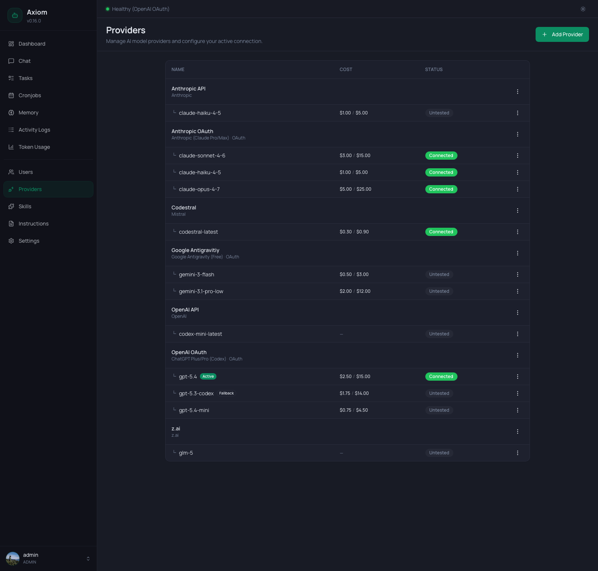

# Providers

The Providers page is where you configure which LLM endpoints Axiom can talk to — API keys, OAuth subscriptions, base URLs, model lists, costs. Every row you add here becomes selectable as the active provider for chat, the default for tasks, and the optional fallback for the Health Monitor.

> **Admin only.** Regular users don't see this page.

## Header

Two buttons on the right:

- **Refresh models** (shown once at least one provider exists) — reloads the model catalogs behind your providers, see [Refreshing model catalogs](#refreshing-model-catalogs).
- **Add Provider** — opens the [provider form dialog](#add-edit-dialog).

The provider list itself re-loads after every successful add / edit / delete / test.

## Two-level table

The table renders providers in **two tiers**:

- **Provider header rows** — one per configured provider. Show the display name and the underlying type (e.g. `Anthropic`, `OpenAI`, `Mistral`, `z.ai`). OAuth providers additionally show `OAuth` after the type label.
- **Model sub-rows** — one per *enabled model* on that provider, indented with `└`. Each carries its own cost, status, and per-model actions.
- **Image models section** — for providers with enabled [image generation models](#image-models), an *Image models* divider followed by one row per image model.

Providers are sorted alphabetically by display name; sub-rows follow the order configured in the provider form.

### Provider header columns

| Column      | Notes                                                                                                |
|-------------|------------------------------------------------------------------------------------------------------|
| **Name**    | Bold display name plus a `Disabled` badge when the provider is [disabled](#disabling-providers-and-models); below it, the provider type label (e.g. *"Anthropic"*, *"Anthropic (Claude Pro/Max) · OAuth"*). |
| **Cost**    | Empty — costs live on the model rows.                                                                |
| **Status**  | Empty for most providers (status lives on the model rows). For **subscription (OAuth)** providers it shows the live [subscriber usage quota](#subscriber-usage-quota-oauth-plans). |
| **⋮**       | **Add Model**, **Add image model** (only for providers with an image backend, currently OpenRouter), Edit, **Disable** / **Enable**, Delete, and — for quota-capable providers — **Refresh quota**. *Delete* and *Disable* are unavailable for the provider that owns the currently active model. |

Clicking anywhere on a header row opens the [Edit dialog](#add-edit-dialog).

### Model sub-row columns

| Column      | Notes                                                                                                |
|-------------|------------------------------------------------------------------------------------------------------|
| **Model**   | Indented model id; small badges for `Active` (green), `Fallback` (outline) and `Disabled` (outline). Both `Active` and `Fallback` can appear on the same row in theory, but the active model is never also the fallback. Models of a disabled provider and disabled models are shown dimmed and struck through. |
| **Cost**    | `$<input>` / `$<output>` per million tokens. Shown as `—` when no cost is configured for that model. |
| **Status**  | One of `Untested`, `Connected`, `Error` — see [Statuses](#statuses).                                 |
| **⋮**       | Test Connection, Set Active, Set Fallback, Remove Fallback, **Edit Model**, Disable / Enable, Remove Model — context-aware (see [Per-model actions](#per-model-actions)). |

### Statuses

The status badge reflects the result of the **last manual test** of that specific model — *not* the live health-check state from the [Health Monitor](../settings/health-monitor).

| Badge        | Meaning                                                                                              |
|--------------|------------------------------------------------------------------------------------------------------|
| `Untested`   | Default for newly added models — no Test Connection has been run.                                    |
| `Connected`  | The last test succeeded. A green banner with the test's response time briefly appears at the top.    |
| `Error`      | The last test failed. The error message appears in a red banner at the top.                          |

While a test is running, the badge is replaced by an inline spinner with the label *"Testing…"*.

For ongoing health monitoring (latency thresholds, automatic fallback switchover), see [Settings → Health Monitor](../settings/health-monitor).

## Active vs. Fallback

Exactly one model is **active** at any time — that's the model the chat agent uses by default and the one the Dashboard shows as healthy/degraded. At most one *other* model is the **Fallback** — the Health Monitor switches to it automatically when the active provider becomes unhealthy.

- The `Active` badge in the screenshot above sits on `gpt-5.4` because that's the configured default.
- The `Fallback` badge sits on `gpt-5.3-codex` — when `gpt-5.4` goes down, the agent transparently routes to `gpt-5.3-codex` until the Health Monitor recovers the primary.

You set both from the row menu — see [Per-model actions](#per-model-actions). To change the *task* default (used by background task agents), go to [Settings → Tasks](../settings/tasks) instead — that's a separate setting.

## Per-model actions

The ⋮ menu on each model row carries up to seven items, shown only when relevant:

| Item                  | When it appears                                                                  |
|-----------------------|----------------------------------------------------------------------------------|
| **Test Connection**   | Always. Sends a small request to the provider/model and updates the status badge. |
| **Set Active**        | When this model is *not* already active and neither it nor its provider is disabled. Promotes it to the global active model.  |
| **Set Fallback**      | When this model is neither active nor the current fallback, and neither it nor its provider is disabled. |
| **Remove Fallback**   | Only on the current fallback model. Clears the fallback selection.                |
| **Edit Model**        | Always. Opens the [Edit Model dialog](#edit-model-dialog) to set or clear a description and per-token costs. |
| **Disable** / **Enable** | Always (*Disable* is unavailable on the active model). See [Disabling providers and models](#disabling-providers-and-models). |
| **Remove Model**      | Always (but disabled in two cases — see below).                                   |

## Disabling providers and models

Instead of deleting a provider or removing a model, you can **disable** it from the ⋮ menu of the provider header row or the model row. A disabled provider or model keeps its configuration (API key, description, costs) and can be re-enabled at any time with **Enable**.

While disabled, it is treated as if it were not configured for LLM work:

- It no longer appears in any provider/model dropdown (Settings → Agent, Tasks, Memory, Cronjobs, task restart, …) or in the `/model` picker in chat and Telegram.
- It is removed from the agent's [`<available_providers>`](../concepts/system-prompt#_8-available_providers-configured-llm-providers) list, and the agent can no longer start tasks or cronjobs on it.
- It can't be set as active or fallback.

Disabling a whole provider affects all of its models. **TTS and STT are not affected:** a disabled provider's credentials can still be used for text-to-speech, speech-to-text and the STT rewrite model.

Guards and automatic adjustments:

- **The active provider/model can't be disabled.** Set a different model as active first.
- **Fallback is cleared.** If the disabled provider/model was the fallback, the fallback is removed.
- **References are reset to default.** Settings that pointed at the disabled provider/model (session summary, fact extraction, memory consolidation, task default, smart loop detection) and cronjobs pinned to it are reset to their default.

### Removing a model

`Remove Model` opens a confirmation dialog:

> **Remove model `<model>`** from provider `<provider>`? This does not uninstall the model, it only removes it from this provider's list.

Two rules guard against breaking your setup:

- **The active model can't be removed.** Switch to a different active model first, then come back.
- **The last remaining model can't be removed.** If you genuinely want to drop a provider's only model, delete the whole provider instead.

A few automatic adjustments happen on confirm:

- If you remove the model that was set as fallback, the fallback is cleared first.
- If you remove the model that was the provider's *default*, the next remaining model becomes the new default automatically — the form doesn't reopen.

## Add / Edit dialog

Opened by **Add Provider** or by clicking a provider header row. The form is small and adapts heavily to the chosen provider type.

### Common fields

The dialog keeps connection details first, then model selection, then advanced health settings:

| Field                  | Notes                                                                                                |
|------------------------|------------------------------------------------------------------------------------------------------|
| **Name**               | Free text, your label for this provider — appears in the table, in `<task_injection>` blocks, on the Dashboard. |
| **Type**               | Dropdown grouped into two sections: **API Key** (OpenAI, Anthropic, Mistral, OpenRouter, DeepSeek, Kimi / Moonshot, MiniMax, xAI (Grok), Google Gemini, OpenCode Zen, OpenCode Go, Radius (API key), Ollama, Custom – OpenAI Chat Completions / OpenAI Responses / Anthropic Messages, …) and **Subscription / OAuth** (Anthropic Claude Pro/Max, OpenAI ChatGPT Plus/Pro, GitHub Copilot, Radius, z.ai (GLM Coding Plan), …). |
| **Base URL**           | Shown directly after Type when the preset has an editable URL (Ollama, Custom, …). |
| **API Key**            | Shown after Base URL for API-key providers. Required for most hosted presets, optional for local/custom providers that do not need auth. |
| **Model**              | Model selector for this provider. Shown **only in create mode** — after creation, models are managed via [Add Model](#add-model-dialog) and [Edit Model](#edit-model-dialog) from the row menus. The exact control depends on the provider type. The first enabled model acts as the provider's default/primary model. |
| **Degraded Threshold** | Last field in the form. Latency in ms above which the provider is marked *Degraded* in health checks. Default `5000`. Lower = more sensitive. |
| **Text verbosity**     | Shown for supported OpenAI Codex/Responses-style providers. `Default` leaves the value unset so pi-ai's provider default applies; `Low`, `Medium`, `High` override response verbosity. |
| **Transport**          | Shown for the same OpenAI Codex/Responses-style providers as **Text verbosity**. Selects the wire-level streaming protocol: `Default (SSE)` leaves the value unset, `SSE`, `WebSocket`, `WebSocket (cached)`, or `Auto`. `WebSocket (cached)` keeps a persistent connection open and ships only delta context items per turn — noticeably faster on long agent sessions. Ignored (and dropped on save) for every other provider type. See [`providers.json` → Transport modes](../reference/settings#transport-modes) for the full table. |

### API-key providers

When you pick a type from the *API Key* group, the fields appear in this order:

#### Base URL

Only visible for presets where the URL is editable (Ollama, Custom, …). For Ollama the placeholder shows the default `http://localhost:11434/v1`.

#### API Key

A password field. Required for most presets, optional for ones that don't strictly need authentication (e.g. an unauthenticated local server added as a Custom provider). In edit mode the field is empty and the hint reads *"Leave empty to keep existing key"* — only type a value if you want to replace the stored secret.

Stored encrypted at rest in `/data/config/providers.json` using `ENCRYPTION_KEY`. See [Configuration](../guide/configuration#why-encryption-key-matters).

#### Model

The model selector adapts to the preset. It is shown **only in create mode** — after a provider exists, you add and remove models via the [Add Model dialog](#add-model-dialog) and the row-menu actions instead. The Ollama panel (below) is the exception: it stays available in edit mode because pulling and managing local models is Ollama-specific.

- **Curated providers (OpenAI, Anthropic, Mistral, DeepSeek, Kimi / Moonshot, MiniMax, xAI (Grok), OpenCode Zen, OpenCode Go, …)** — a dropdown of known models. Pick the one you want; it becomes the provider's initial enabled model and acts as its default until you enable more. If the model you need isn't in the catalog, type its id in the custom-model field below the dropdown and click **Add**. OpenCode Zen and Go source their catalog (models, per-token costs, per-model API type) directly from the bundled `@earendil-works/pi-ai` registry, so they stay in sync with [OpenCode Zen](https://opencode.ai/docs/zen) whenever that dependency is updated — no manual price table to maintain.
- **Dynamic-catalog providers (OpenRouter)** — in create mode this behaves like the curated dropdown above (bundled catalog). Once the provider exists, the [Add Model dialog](#add-model-dialog) fetches the model list **live** from the provider's own `/models` endpoint (using the stored base URL and API key) instead of the bundled catalog, so newly published models appear without waiting for an Axiom release. If the live fetch fails, Axiom falls back to the bundled `@earendil-works/pi-ai` catalog so the picker still works offline.
- **Radius** (`radius` via OAuth, `radius-api-key` via an organization API key) — [Radius](https://radius.earendil.com/) is Earendil's Pi-native gateway (prepaid credits, routing, rewrite rules). It has no bundled catalog: the model list, prices, context windows and thinking-level support are fetched from the gateway's public `/v1/config` endpoint and cached in `config/radius-catalog.json`. The cache is refreshed when the create-mode model dropdown loads (if older than six hours), every time you open the Add Model dialog, and on backend start when a Radius provider exists and the cache is stale. Refreshes triggered by an existing provider use its credential so organization-private (BYOK) models are included. The OAuth variant uses the device-code flow: Axiom opens the Radius pairing page (with the code pre-filled) and also shows the code in the dialog, so it works for remote deployments. Radius speaks Pi's native `pi-messages` wire protocol, not the OpenAI API.
- **Custom** — has no bundled catalog. After creating the provider, the [Add Model dialog](#add-model-dialog) loads the model list live from `<Base URL>/models` (or `<Base URL>/v1/models`) using the stored API key.
- **Ollama** — a separate panel with its own controls (see below).

#### Degraded Threshold

Always shown last once a provider type is selected. It controls the latency threshold used by health checks.

### Custom providers

Pick one of the three **Custom** entries from the *API Key* group whenever you want to talk to a service that doesn't have a dedicated preset in Axiom — for example NVIDIA NIM (`build.nvidia.com`), self-hosted vLLM, LM Studio, llama.cpp's OpenAI server, LiteLLM proxies, Anthropic-compatible gateways, or in-house deployments. The entry decides the wire format:

| Type entry | `providerType` | Requests go to | API key sent as | Model list from |
|---|---|---|---|---|
| **Custom – OpenAI Chat Completions** | `custom-openai-completions` | `<Base URL>/chat/completions` | `Authorization: Bearer` | `/models` |
| **Custom – OpenAI Responses** | `custom-openai-responses` | `<Base URL>/responses` | `Authorization: Bearer` | `/models` |
| **Custom – Anthropic Messages** | `custom-anthropic-messages` | `<Base URL>/v1/messages` | `x-api-key` | `/v1/models` |

In edit mode you can switch between the three entries; the form flags compatibility options the new format doesn't support.

Unlike the curated presets, this type carries no model catalog and no fixed endpoint:

| Field              | What to enter                                                                                              |
|--------------------|------------------------------------------------------------------------------------------------------------|
| **Name**           | Any label (e.g. `NVIDIA NIM`, `Local LM Studio`).                                                          |
| **Type**           | One of the **Custom – …** entries above.                                                                   |
| **Base URL**       | Required. For Chat Completions / Responses the root that exposes `/chat/completions` or `/responses` (usually ending in `/v1`); for Anthropic Messages the root **without** `/v1` — requests go to `<Base URL>/v1/messages`. |
| **API Key**        | Optional. Leave blank for unauthenticated local servers; paste the upstream key for hosted services.       |
| **Compatibility options (compat)** | Optional JSON object with pi-ai `compat` options — the same format as the `compat` block of a pi `models.json` (pasting a provider entry that contains a `compat` key works too). The options apply to every model of the provider. The dialog lists the options valid for the selected type and rejects unknown keys or values. Leave empty to let pi-ai auto-detect behaviour from the URL. |
| **Models**         | Added after creation via [Add Model](#add-model-dialog), which loads the provider's model list live (or lets you type an exact model id such as `meta/llama-3.1-405b-instruct`). No prefix is stripped. The first model added acts as the provider's default. |
| **Degraded Threshold** | Optional latency threshold override; defaults to `5000` ms.                                           |

The provider is wired through the matching pi-ai API (`openai-completions`, `openai-responses` or `anthropic-messages`), so streaming, tool-calling, and reasoning capture work the same way they do for the built-in presets.

#### When to set compat options

For URLs pi-ai doesn't recognize it assumes the official OpenAI behaviour. Self-hosted or proxied endpoints often differ; typical Chat Completions settings:

| Symptom | compat |
|---|---|
| Error about the `developer` role / system prompt ignored | `"supportsDeveloperRole": false` |
| Error about `max_completion_tokens` | `"maxTokensField": "max_tokens"` |
| Error about the `store` field | `"supportsStore": false` |
| Thinking level has no effect or the server rejects `reasoning_effort` | `"thinkingFormat"` matching the server (e.g. `"qwen"`, `"deepseek"`, `"chat-template"`), or `"supportsReasoningEffort": false` |

**Test Connection** sends the request through pi-ai with a short system prompt, so it uses the API type and compat options exactly like the agent does and surfaces role or field errors.

#### Example: NVIDIA NIM (`build.nvidia.com`)

1. Grab a key from <https://build.nvidia.com> (header `Authorization: Bearer nvapi-…`).
2. **Add Provider** → pick **Custom – OpenAI Chat Completions**.
3. Fill the form:
   - **Name** → `NVIDIA NIM`
   - **Base URL** → `https://integrate.api.nvidia.com/v1`
   - **API Key** → `nvapi-…`
4. **Save**, then open **Add Model** in the provider's ⋮ menu and pick a model (or type an id such as `mistralai/mistral-medium-3.5-128b`).
5. Hit **Test** on the model row to confirm the endpoint and key are good.

##### Possible NVIDIA NIM chat models (as of 05/2026)

NVIDIA's catalog changes over time and includes non-chat models (embedding, rerank, image, speech, safety, parsing). Only add models that successfully pass **Test Connection** in Axiom.

> **Current reliability note (05/2026):** NVIDIA NIM's hosted/free endpoints can be very slow or intermittently fail with API errors/timeouts. The service appears overloaded at times. Treat these models as experimental until repeated **Test Connection** runs and real chat usage are stable for your account/region.

Models that work with **Custom – OpenAI Chat Completions**:

- `mistralai/mistral-medium-3.5-128b`
- `google/gemma-4-31b-it`
- `moonshotai/kimi-k2.6`
- `minimaxai/minimax-m2.7`

#### Example: Local LM Studio / vLLM

1. Start LM Studio's OpenAI server (defaults to `http://localhost:1234/v1`) or a `vllm serve …` instance.
2. **Add Provider** → **Custom – OpenAI Chat Completions**.
3. Fill in:
   - **Name** → `LM Studio`
   - **Base URL** → `http://localhost:1234/v1`
   - **API Key** → leave blank (LM Studio ignores it)
   - **Compatibility options** → if the test complains about roles or fields, e.g. `{ "supportsDeveloperRole": false, "maxTokensField": "max_tokens" }`
4. **Save** → **Add Model** → pick the loaded model (e.g. `qwen2.5-coder-32b-instruct`) → **Test**.

#### Example: Anthropic-compatible gateway

1. **Add Provider** → **Custom – Anthropic Messages**.
2. **Base URL** → the root without `/v1` (e.g. `https://gateway.example.com/anthropic`), **API Key** → the gateway key (sent as `x-api-key`).
3. **Save** → **Add Model** (loaded from `<Base URL>/v1/models` when the gateway offers it) → **Test**.

Wire formats other than these three (Google Gemini, Bedrock, Azure OpenAI with `api-key` headers, …) need a dedicated preset.

### Ollama-specific controls

Picking the `ollama` type swaps the model selector for a dedicated Ollama panel:

- **Refresh button** — loads installed models from the Ollama API at the configured Base URL.
- **Installed models** — checkbox list with model name, parameter size, quantization, and on-disk size. Tick the ones you want to enable on this provider.
- **Pull Model** — type a model name (e.g. `llama3`, `gemma4`, `mistral`) and hit `Pull`. A live progress bar shows the percentage and the current pull stage. On success the model appears in the list above and can be ticked.

If Ollama can't be reached, you see a destructive banner with *"Could not reach Ollama"* and a retry link.

### OAuth providers

Picking a type from the *Subscription / OAuth* group changes the form's submit button: instead of `Save`, you see **Login & Connect**.

The full flow:

1. Type a **Name**, pick the OAuth provider type, optionally tick which models to enable.
2. Click **Login & Connect**. A new browser tab opens with the provider's auth page.
3. Complete the login. The dialog updates to *"Waiting for authentication…"* with a spinner.
4. Once the redirect comes back, the dialog closes and the provider appears in the list.

**Remote server fallback.** If your Axiom instance runs on a remote box where the OAuth callback URL can't reach you, a manual-code field appears below the spinner: *"Or paste the redirect URL here (for remote servers)"*. Complete the login locally, copy the full redirect URL from the browser, paste it in, and click **Submit**.

### Subscriber usage quota

For subscription-style providers that expose a usage endpoint, the provider header row's **Status** column shows how much of your subscription allowance is left, polled in the background (no manual action needed). Quota is currently supported for:

- **Anthropic Claude Pro/Max** (`anthropic-oauth`)
- **OpenAI ChatGPT Plus/Pro (Codex)** (`openai-codex`)
- **OpenCode Go** (`opencode-go`) — see the credential note below
- **z.ai (GLM Coding Plan)** (`zai-coding`) — read from the subscription API key; the pay-per-token `z.ai` (`zai`) provider has no quota endpoint
- **Radius** (`radius` via OAuth and `radius-api-key`) — shows the organization's **prepaid credit balance** instead of usage windows (see below)
- **OpenRouter** (`openrouter`) — shows the remaining **prepaid credit** instead of usage windows (see below)

Other provider types never show quota — they have no usage endpoint.

#### Radius credit balance

Radius is pay-as-you-go, so there are no rate-limit windows. The Status column shows the **available** credit (balance minus the amount reserved for in-flight requests) as a currency amount, plus what has been charged in the current billing period, e.g. `Credits: $8.97 ($0.01 this period)`. It turns red once the available balance reaches zero. The data comes from the gateway's `/v1/billing` endpoint using the same credential as inference (OAuth access token or organization API key).

#### OpenRouter credit balance

OpenRouter is pay-as-you-go as well, so the Status column shows the **available** credit as a dollar amount, plus what the API key has spent in the current calendar month (UTC), e.g. `Credits: $13.47 ($0.42 this period)`. It turns red once nothing is left. Axiom reads two endpoints with the provider's normal API key — no management key is needed:

- `/api/v1/credits` — the account balance (purchased credits minus all-time usage).
- `/api/v1/key` — the key's own credit limit, if you set one on the OpenRouter keys page.

When the key has a credit limit below the account balance, the **lower** of the two is shown, because that is what new requests can actually spend; the `provider_quota` tool reports both. If OpenRouter stops answering `/api/v1/credits` for regular keys, the key's remaining limit is shown instead; a key without a credit limit then shows *"Quota unavailable"*, since there is no balance to report.

::: warning OpenCode Go is a special case
OpenCode Go has no official usage API. Its quota is read by scraping the authenticated web dashboard. Configure the provider's extra fields in the provider dialog:

- **Workspace ID** — the id from `opencode.ai/workspace/<id>/go`
- **Dashboard Auth Cookie** — a valid dashboard auth cookie (the `auth=` prefix is optional)

Quota is only shown once **both** fields are set. Because it parses dashboard markup rather than a stable API, this integration can break if the dashboard layout changes; in that case the Status column falls back to *"Quota unavailable"* and inference is unaffected.
:::

Each usage window appears on its own line as `<window>: <utilization>% (<reset>)`. The exact windows depend on the provider:

| Provider              | Windows                                                                 | Reset shown as                          |
|-----------------------|------------------------------------------------------------------------|-----------------------------------------|
| Anthropic Claude      | `5h` (rolling 5h), `7d` (rolling 7d), `Opus` / `Sonnet` (7d model-specific windows; only shown when above 0%). | `5h` relative (e.g. `2h 14m`); `7d`/`Opus`/`Sonnet` weekday + time (e.g. `Mon 3:00PM`). |
| OpenAI ChatGPT (Codex)| Primary + secondary rate-limit windows (labelled by their length, e.g. `5h`, `7d`). | Primary relative; secondary weekday + time. |
| OpenCode Go           | `5h` (rolling), `7d` (weekly), `30d` (monthly). | `5h` relative; `7d`/`30d` weekday + time. |
| z.ai (GLM Coding Plan)| `5h` (rolling), `7d` (weekly). | `5h` relative; `7d` weekday + time. |

The percentage is colour-coded: green below 70%, amber at 70–89%, red at 90%+. Reset times and currency amounts follow your browser's regional settings.

The same active-provider quota is mirrored in the **top bar** next to the health status — but only on wide (`lg`) viewports, and only for the *active* provider. It is hidden on smaller screens and for non-active providers.

#### Refresh quota

The ⋮ menu on a quota-capable provider header carries a **Refresh quota** item that forces an immediate, on-demand fetch (bypassing the background poll's backoff). While it runs, the Status column shows a spinner with *"Refreshing…"*; on success a *"Quota updated"* banner appears briefly.

#### When quota is unavailable

These usage endpoints are aggressively rate-limited. Axiom applies a per-provider backoff on `429` responses and **keeps the last good snapshot** during transient failures instead of flapping to "unavailable". When there is no usable data, the Status column shows:

- *"Rate-limited — try again shortly"* — a `429` was hit and no earlier snapshot exists yet. Wait a bit, or use **Refresh quota** later.
- *"Quota unavailable"* — any other failure (auth error, network, …). Hover the text for the underlying error.

### Renewing OAuth tokens

In **edit** mode for an OAuth provider, the dialog footer shows a **Renew Token** button on the left. OAuth refresh tokens have a fixed lifetime — when they expire, the model status flips to `Error` with an authentication failure. Click **Renew Token** to start the OAuth flow again with the existing provider record (no new row, no lost configuration).

## Refreshing model catalogs

Most presets get their model list, prices, limits and thinking-level support from the model catalog bundled with `@earendil-works/pi-ai`. New models (e.g. a new Claude release) would otherwise only appear after an Axiom update. **Refresh models** in the page header fixes that without an update:

- **pi catalog** — for every configured provider whose preset uses the bundled catalog (Anthropic, Claude Pro/Max, OpenAI, ChatGPT/Codex, GitHub Copilot, Google, DeepSeek, xAI, Mistral, OpenCode Zen/Go, OpenRouter, …) Axiom loads the current catalog from `https://pi.dev/api/models/providers/<provider>` — the same source the pi CLI uses for `pi update --models`. Only the provider id is sent, never an API key. Providers that share a catalog (e.g. *Anthropic* and *Claude Pro/Max*) are fetched once.
- **Radius** — reloads the gateway catalog with the provider's credential.

The result is cached in `config/pi-catalog.json` and stays in effect across restarts and offline. Refreshed entries replace bundled entries with the same id; models only present in the bundled catalog are kept. Models whose wire API this Axiom build cannot talk to are ignored. Nothing refreshes automatically — the catalog only changes when you click the button.

After a refresh, a summary lists new models per provider, providers without changes, failed refreshes, and — for subscription, OpenCode and Radius providers — enabled models the catalog no longer lists. Such models fall back to a generic configuration and may stop working; remove or replace them.

Custom providers, Ollama and the live OpenRouter list are not part of this refresh: their models are loaded live in the [Add Model dialog](#add-model-dialog) (with its own refresh button).

## Add Model dialog

Opened from the provider header row's ⋮ menu → **Add Model**. Lets you enable additional models on an existing provider without reopening the provider form.

- **Search** — filters the provider's model catalog by name or id. For most providers the catalog is fetched from the bundled `@earendil-works/pi-ai` registry (same source as the create-mode dropdown). **Dynamic-catalog providers (OpenRouter, Radius, Custom)** instead fetch the list live from the provider (the `/models` endpoint, Anthropic-style `/v1/models`, or Radius' `/v1/config`), falling back to the bundled/cached catalog if that request fails. Custom providers have no fallback catalog, so a failed request shows the upstream error instead.
- **Refresh** — the button next to the search field (dynamic-catalog providers only) reloads the live list.
- **Metadata from `/models`** — when the endpoint reports it, the context window (`context_length` or `max_input_tokens`), max output tokens (`max_output_tokens`) and pricing (OpenRouter's `pricing`, including `input_cache_read` / `input_cache_write`) are stored with the model when you add it. Entries whose `mode` is not a chat mode (e.g. `embedding`, as reported by LiteLLM-style proxies) are hidden.
- **Model list** — scrollable, multi-select. Models already enabled on this provider appear greyed out with an *"already enabled"* label. Tick the ones you want to add.
- **Custom model fallback** — when your search text doesn't match any catalog entry, a button appears to add the typed id as a custom model (e.g. a manually published model not yet in pi-ai).
- **Add** — merges the selected models into the provider's enabled list. The footer shows the number selected.

If the catalog fetch fails, an error message with a retry link is shown.

## Edit Model dialog

Opened from a model sub-row's ⋮ menu → **Edit Model**. Sets per model:

- **Description** — a free-form note describing what this model is suited for (e.g. *"Fast model for text processing like Twitter/Reddit Digest"*). The description is surfaced in the system prompt's [`<available_providers>` block](../concepts/system-prompt#_8-available_providers-configured-llm-providers) and doubles as the opt-in gate for agent model routing: a model without a description (and that isn't the active or default task model) is hidden from the agent's routing list. Clear the field to remove a model from the routing list.
- **Cost** — per-million-token input and output costs in USD. **Cache read** and **cache write** fields are always shown for providers whose models are built from Axiom's own configuration (see below); for other providers they appear only when the resolved cost already carries cache values, or for Anthropic providers. Enter `0` for a free model. Cache prices apply to the cache tokens the provider reports (e.g. OpenAI-style `cached_tokens`) and flow into the cost shown on the [Token Usage page](./token-usage).

For providers whose models are built from Axiom's own configuration (API-key presets such as Custom, OpenRouter, DeepSeek, …) the dialog additionally offers:

- **Display name**.
- **Token limits** — context window and max output tokens. Without a value Axiom assumes 128k context and 16,384 output tokens.
- **Image input** — whether the model accepts images.
- **Reasoning / thinking** — must be on for the configured [thinking level](../settings/agent#thinking-level) to be sent to this model.
- **Supported thinking levels** — per level (`minimal` … `max`), whether the model supports it and which value is sent to the API (empty = the level name). Unsupported levels are rounded to the nearest supported one. `xhigh` and `max` are only used when ticked. This mirrors pi's `thinkingLevelMap`.
- **Import from pi config** — paste a pi `models.json` (a single model object, a provider, or the whole file); the entry matching the model id fills `name`, `contextWindow`, `maxTokens`, `input`, `reasoning`, `thinkingLevelMap` and `cost` (including `cacheRead` / `cacheWrite`). Review and save afterwards.

Subscription/OAuth providers, OpenCode Zen/Go and Radius take these values from their upstream catalog, so the section is hidden for them.

**Your values vs. catalog values.** A filled field is your own value and overrides the catalog. An empty field shows the current catalog value as placeholder and keeps following the catalog — including after [Refresh models](#refreshing-model-catalogs). Only the fields you change are stored; clearing a field removes your value again. **Reset to catalog values** (bottom left, shown when the model has own values) removes all own values except the description. Entries saved by older Axiom versions stored a full copy of the catalog values; reset them once to let them follow the catalog.

## Image models

Image generation models are configured separately from text models. They come from pi-ai's **image catalog** (not the text catalog), are only used by the agent's [`generate_image`](../concepts/image-generation) tool, and never appear in chat, task, cronjob, consolidation or other text-model selectors, nor in the text-model list of the system prompt. Currently only **OpenRouter** providers offer image models.

### Add image model dialog

Opened from the provider header row's ⋮ menu → **Add image model**.

- **Search** — filters the provider's image catalog by name or id, e.g. `vector` finds `recraft/recraft-v4.1-vector`.
- **Model list** — multi-select. Models that accept input images (and can therefore edit or vary existing images) carry an *edits images* badge. Models already enabled are greyed out.
- **Custom model fallback** — when the search text matches no catalog entry, you can add the typed id (e.g. a model OpenRouter published after the bundled catalog). Such models are sent as image-only requests.
- **Add** — stores the selection in the provider's `enabledImageModels`.

### Image model rows

Below the text models, an *Image models* divider lists the enabled image models. They show no thinking levels and no context window; the cost column reads *per image* because image models are billed per image — the real cost is reported after every generation (tool result, sidecar file, [Token Usage](./token-usage)).

The ⋮ menu of an image model row offers:

| Item | What it does |
|---|---|
| **Check availability (free)** | Replaces *Test Connection* for image models, which would otherwise send a chat request. For OpenRouter it calls `GET /api/v1/models/<id>/endpoints` (the model exists, generates images and has live endpoints) and `GET /api/v1/key` (the API key is valid). Neither call generates anything or costs money. Updates the status badge and shows the latency like a text-model test; above the provider's *Degraded Threshold* the result is reported as slow. |
| **Generate test image (paid)…** | Opens a dialog with a cost warning. Only after you confirm it generates **one** small image with a fixed prompt, shows the preview, the billed cost reported by the provider and the duration, and books the cost in [Token Usage](./token-usage). |
| **Edit Model** | Display name and **description**. The description is shown to the agent in the *Image generation models* list of the system prompt and helps it choose a model (e.g. *"Logos and icons as SVG"*). |
| **Remove Model** | Removes the model from `enabledImageModels`. |

Which image model the agent uses by default, and whether image generation is switched on at all, is set in [Settings → Image Generation](../settings/image-generation) — there is no default toggle on this page. That tab also lists all enabled image models, each linking back to its provider here.

### Migration of image models added as text models

Before this section existed, image models could only be added through **Add Model** as text models, where every chat request to them failed. On the first start after the update, ids that pi-ai lists **only** as image models (e.g. `openai/gpt-5-image-mini`, `google/gemini-3.1-flash-image`, `recraft/recraft-v4.1`) are moved from the text models to the image models automatically. Ids that are also chat models (e.g. `google/gemini-3-pro-image`) and the current active or fallback model stay text models. Descriptions and display names are kept. The live OpenRouter list in **Add Model** no longer offers image-only models. Details: [Image Generation → Migration](../concepts/image-generation#migration-of-existing-configurations).

## Delete provider

The provider's row menu has a **Delete** item. Confirm dialog:

> Are you sure you want to delete provider `<name>`?

Rules:

- **Can't delete the active provider.** The button is disabled in the menu. Set a different model as active first.
- **Linked secrets are removed too.** The encrypted API key and any OAuth tokens for that provider are wiped from `/data/config/providers.json`.
- **Per-cronjob pins.** If a cronjob was pinned to this provider/model pair, it falls back to the default the next time it runs. To stop a cronjob from running on a missing provider, edit it under [Cronjobs](./cronjobs).

## Empty state

When you have no providers configured yet, the table is replaced by a centered plug icon and the message *"No providers configured yet. Add one to get started."* with an inline `Add Provider` button.

This is what you see right after first install — until at least one provider is configured, the chat agent can't respond.

## See also

- [Configuration](../guide/configuration) — encryption (`ENCRYPTION_KEY`), where API keys live on disk.
- [Settings → Agent](../settings/agent) — choosing the active provider/model from the Settings side; same data, different entry point.
- [Settings → Tasks](../settings/tasks) — separate default provider for background task agents.
- [Settings → Health Monitor](../settings/health-monitor) — periodic health checks, automatic fallback switchover.
- [Token Usage](./token-usage) — actual spend per provider and model over time.
- [Image Generation](../concepts/image-generation) — how image models, the default image model and `generate_image` fit together.
