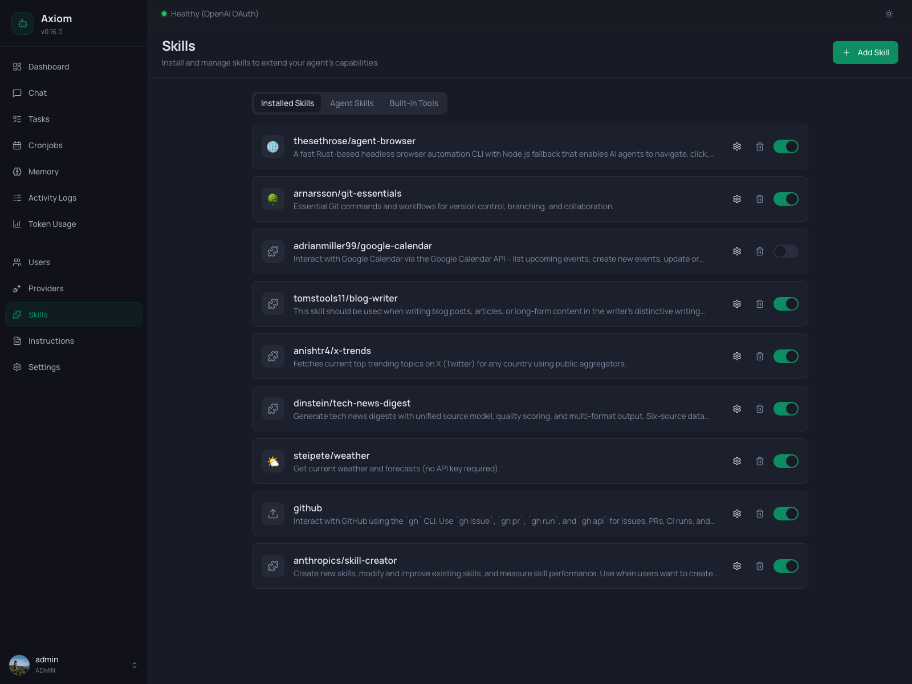

# Skills

The Skills page is where you install, configure, and manage everything that extends what the agent knows how to do — community skills from GitHub, your own uploaded skill packages, the agent's self-written skills, and the small set of built-in tools that ship with Axiom.

> **Admin only.** Regular users don't see this page.

> **What is a skill?** This page is about *managing* skills. For what skills are, the difference between skills and tools, the three flavors (user-installed / agent-created / built-in), and the `SKILL.md` contract, see [Skills concept](../concepts/skills).

## Layout

The page is a single tab bar with three tabs and a per-tab page header action:

| Tab                           | What it shows                                                                                          | Header action |
|-------------------------------|--------------------------------------------------------------------------------------------------------|---------------|
| [Installed Skills](#installed-skills) | Skills you installed via URL or file upload. Disk: `/data/skills/<owner>/<name>/`.            | `Add Skill`   |
| [Agent Skills](#agent-skills)         | Skills the agent wrote for itself, plus the built-in skills shipped with Axiom. Read-only here. Disk: `/data/skills_agent/<name>/`. | —         |
| [Built-in Tools](#built-in-tools)     | The two compiled-in tools (`web_fetch`, `web_search`) and their config. Not skills — actual TypeScript tools. | —     |

The screenshot at the top shows the **Installed Skills** tab.

## Installed Skills

The default tab. One card per skill, each with:

- **Icon / Emoji** — the skill's emoji from its `SKILL.md` frontmatter, or a generic puzzle/upload icon as a fallback.
- **Skill id** — `<owner>/<name>` for skills installed from URL (e.g. `thesethrose/agent-browser`), or just the bare name for skills installed via file upload (the `uploaded/` prefix is hidden in the UI but kept on disk).
- **Description** — single-line summary from the skill's frontmatter, truncated.
- **Settings (gear)** — opens the [per-skill settings dialog](#per-skill-settings).
- **Delete (trash)** — opens a confirmation dialog. Removing a skill removes its files from disk.
- **Enabled toggle** — flips `enabled` on the skill record. Disabled skills are hidden from `<available_skills>` in the system prompt — the agent can't see or load them.

### Empty state

When you haven't installed any skills yet:

> *"No skills installed."* Skills add new capabilities to your agent. Install your first skill to get started.

Comes with an inline `Add your first skill` button.

### Add Skill dialog

Opened by the **Add Skill** button (or the empty-state button). Two install modes selected via tabs at the top:

#### From URL

A single text input. Accepts:

- **OpenClaw shorthand** — `<owner>/<name>` (e.g. `zats/perplexity`). The backend resolves this to a GitHub URL via the OpenClaw skill registry.
- **Direct GitHub URL** — including subpath URLs that point at a single skill inside a multi-skill repo, e.g. `https://github.com/anthropics/skills/tree/main/skills/pdf`.

Two example chips below the input show the supported formats. Press `Enter` or click `Install` to fetch.

#### Upload File

A drag-and-drop zone (or click-to-pick). Accepts `.zip` and `.skill` files, up to 50 MB. Selected files appear as a single row with name, size, and an `×` button to remove.

Uploaded skills land under `/data/skills/uploaded/<name>/` on disk; in the UI they show up without the `uploaded/` prefix and with an upload-arrow icon.

#### Errors

If the install fails (invalid URL, bad zip, missing `SKILL.md`, name collision, …), a destructive banner appears inside the dialog with the backend's error message. The dialog stays open so you can fix and retry.

### Per-skill settings

The gear icon on a skill row opens its settings dialog. The title shows the skill's emoji and id; the body is one section: environment variables.

#### Declared env vars

Every variable the skill's `SKILL.md` declares under `required_env_vars` is rendered as a labeled password input. Existing values are masked — the placeholder reads *"Enter value (leave empty to keep current)"*. Type a new value to replace the stored one, or leave blank to keep what's already saved.

Declared variables can't be removed from this list — they're declared by the skill author, so removing them from the configuration would break the skill's own contract.

#### Custom env vars

Below the declared list there's an *Add Environment Variable* row with a text input (placeholder `VARIABLE_NAME`) and a `+` button. Adding here lets you set values for variables the skill doesn't declare in its frontmatter — useful when a skill reads secondary env vars at runtime that weren't documented in `SKILL.md`.

Custom (i.e. not declared) variables get an `×` next to their label so you can remove them later.

#### Save

The Save button writes both `envValues` (the actual secret values) and `envKeys` (the list of custom keys, so they show up next time). Values are stored encrypted at rest in `skills.json` using `ENCRYPTION_KEY` — see [Configuration](../guide/configuration#why-encryption-key-matters).

> **Skill env vars vs. global secrets.** Skill env vars are scoped to the loading agent's environment for *that skill's* execution. For values that should be available to *every* skill (or to shell tools generally), use [Settings → Secrets](../settings/secrets) instead — those become process-level env vars.

### Delete a skill

The trash icon on a skill row opens a `ConfirmDialog`:

> Are you sure you want to delete skill `<name>`? This will remove the skill files from disk.

Confirming deletes the directory under `/data/skills/<owner>/<name>/` and the skill's row in `skills.json`. Cronjobs that had this skill in their `attachedSkills` list keep the reference but the runner will warn at firing time and skip the missing skill — see [Tasks & Cronjobs → `attached_skills`](../concepts/tasks-and-cronjobs#attached-skills).

## Agent Skills

The second tab — read-only. Lists every skill under `/data/skills_agent/`, which is where:

- **The agent itself** writes skills it produces during conversations (e.g. when you ask "make this a reusable workflow").
- **Built-in skills** shipped with Axiom land after the entrypoint seeds them on container start (e.g. `tasks-and-cronjobs`, `wiki`, `nitter`).

Both kinds are indistinguishable at runtime — the difference is only at startup, where built-ins may be auto-updated based on their semver. See [Skills concept → built-in skills](../concepts/skills#built-in-skills) for the full mechanics.

### Cards

Each card shows:

- A sparkles icon (signaling agent-side rather than user-installed).
- The skill **name** and one-line **description** (from `SKILL.md`).
- **Metadata badges** when the skill declares any optional gating in its frontmatter:
  - **⚠ `<VAR>`** *(warning)* — a `required_env_vars` value is missing from the environment. The skill is still listed but won't load successfully without the variable.
  - **`<platform>`** *(secondary)* — platforms the skill supports (`linux`, `macos`, …). Skills with a non-matching platform are hidden from the prompt entirely; this badge is a hint to operators when running the backend outside the standard Linux container.
  - **needs: `<toolset>`** *(muted)* — a tool the skill depends on. Skills whose required toolset is disabled don't show up in `<available_skills>` at all; the badge tells you which prerequisite to re-enable.

Hovering any badge reveals a tooltip with the same explanation.

### What's *not* on this tab

- No install action — agent skills are produced by the agent (or shipped with the image), not added by hand.
- No delete or toggle — these skills are always loadable by the agent. To remove a built-in skill permanently, see the `managed: false` opt-out described in [Skills concept](../concepts/skills#anatomy-of-a-skill-md).
- No env-var configuration — agent skills that need secrets typically read them from process-level env vars (configured under [Settings → Secrets](../settings/secrets)).

### Empty state

> *"No agent-created skills yet."* The agent can create its own skills during conversations. They will appear here.

This state is rare in practice — the built-in skills are seeded on every container start, so the tab is usually populated immediately.

## Built-in Tools

The third tab is *not* a skill list — it's the configuration surface for the two compiled-in tools that ship with the Axiom binary.

### web_fetch

A single card with a description and an **enabled toggle**. Disabling it removes the `web_fetch` tool from the agent's tool registry — the agent can't fetch URLs anymore. There is no further configuration.

The toggle saves immediately on flip; no separate Save button.

### web_search

A more configurable card. Title, description, and an enabled toggle at the top.

When enabled, three additional fields appear:

| Field             | Notes                                                                                                |
|-------------------|------------------------------------------------------------------------------------------------------|
| **Search Provider** | `DuckDuckGo` (default, no key needed), `Brave Search`, `SearXNG`, or `Tavily`.                    |
| **Brave Search API Key** | Visible only when provider = Brave. Password field; existing key is masked. Hint: *"Leave empty to keep the existing key."* |
| **SearXNG Instance URL** | Visible only when provider = SearXNG. Free-text URL. Use this for self-hosted SearXNG instances. |
| **Tavily API Key** | Visible only when provider = Tavily. Password field; existing key is masked. Get a free key at <https://app.tavily.com> (1,000 queries/month free). |

Click **Save** at the bottom of the card to persist the changes. Unlike the toggle, the provider/key/URL fields don't auto-save — you have to click Save explicitly.

The Brave and Tavily API keys are encrypted at rest in the same way as provider API keys; see [Configuration → Why `ENCRYPTION_KEY` matters](../guide/configuration#why-encryption-key-matters).

## See also

- [Skills concept](../concepts/skills) — what skills are, the three flavors, the `SKILL.md` contract, gating fields, built-in skill auto-update mechanics.
- [Built-in Tools](../concepts/tools) — the broader catalog of compiled-in tools (only `web_fetch` and `web_search` are user-configurable from this page).
- [Tasks & Cronjobs → `attached_skills`](../concepts/tasks-and-cronjobs#attached-skills) — how to bake a skill's `SKILL.md` directly into a cronjob's prompt.
- [Settings → Secrets](../settings/secrets) — global env vars / process-level secrets (alternative to per-skill env vars).
- [Configuration](../guide/configuration#why-encryption-key-matters) — the `ENCRYPTION_KEY` that protects skill env values and provider keys at rest.
