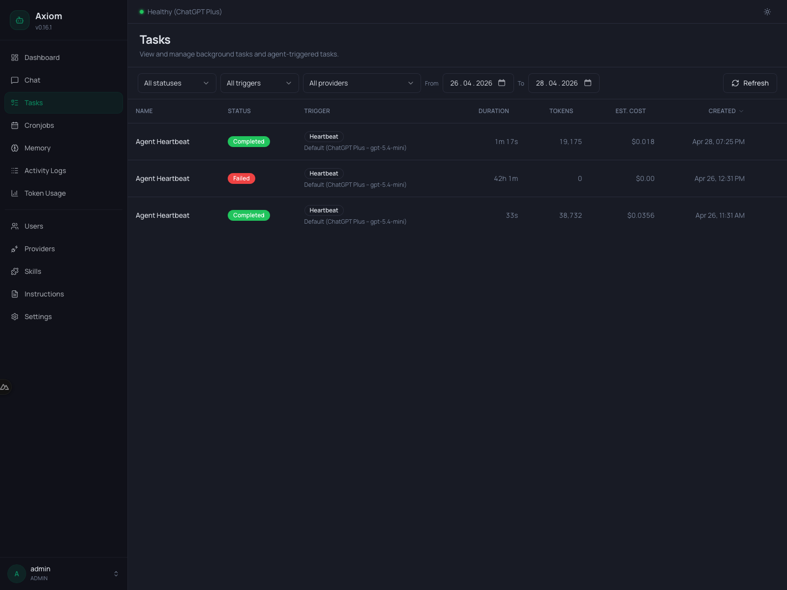
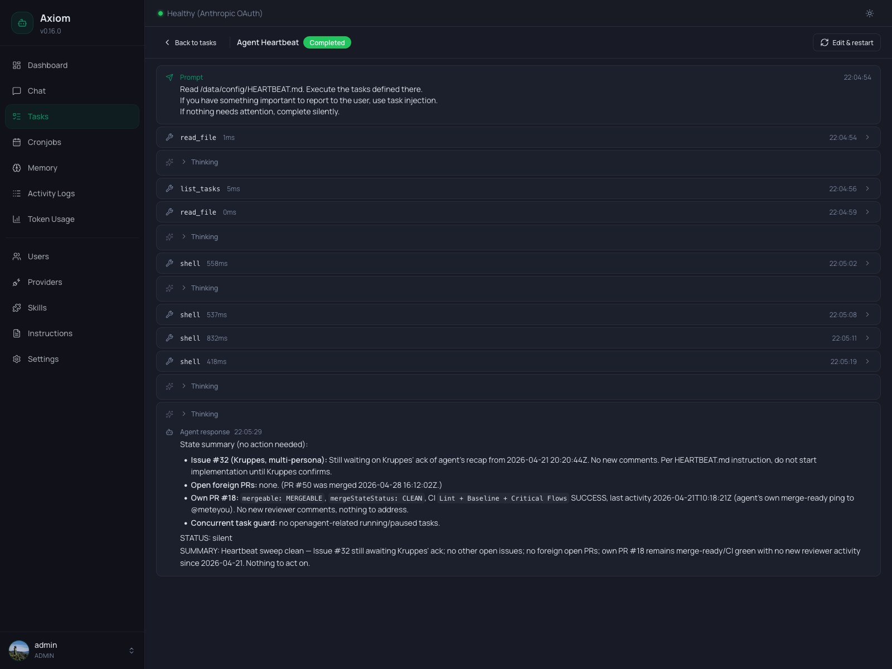

# Tasks

The Tasks page is your window into background work. Every task — whether started by you, by the agent mid-conversation, or by a cronjob firing — lands here with full status, cost, and event history.
 
It has two views: a **list** of all tasks (default), and a **detail viewer** that opens when you click a row.

> **Admin only.** Regular users don't see this page at all.

> **What is a task?** This page is about *operating* tasks. For the architecture — what a task actually is, how it's isolated from chat, how `<task_injection>` blocks come back, and the difference between tasks, cronjobs, and reminders — see [Tasks & Cronjobs concept](../concepts/tasks-and-cronjobs).

## List view

The list view is everything you see until you click into a single task.

### Filter toolbar

Six filters sit at the top. They combine with AND semantics — pick a status *and* a trigger *and* a date range to narrow down.

| Filter       | Options                                                   |
|--------------|-----------------------------------------------------------|
| **Status**   | All, Running, Paused, Completed, Failed.                  |
| **Trigger**  | All, User, Agent, Cronjob, Heartbeat, Consolidation.      |
| **Provider** | All, *Default*, or a specific `provider (model)` pairing. |
| **From**     | Date — only tasks created on or after this day.           |
| **To**       | Date — only tasks created on or before this day.          |
| **Refresh**  | Re-fetches the current page immediately.                  |

The provider dropdown only shows providers that *some* task has actually used — it's discovered from the data, not from the configured-providers list. The special `Default` entry collects all tasks that ran on whatever was configured as the [task default](../settings/tasks) at the time, regardless of which provider that resolved to.

See [Tasks & Cronjobs → Triggers](../concepts/tasks-and-cronjobs#triggers) for what each trigger type means.

### Columns

| Column        | Notes                                                                               |
|---------------|-------------------------------------------------------------------------------------|
| **Name**      | The task name, truncated. Click anywhere on the row to open the detail view.        |
| **Status**    | Colored badge: gray (running), green (completed), red (failed), amber (paused).     |
| **Trigger**   | Trigger badge plus, on a second line, the provider/model the task ran on.           |
| **Duration**  | Live for running tasks (counts up), final for completed ones, `—` if never started. |
| **Tokens**    | Total prompt + completion. Hover for the prompt/completion split.                   |
| **Est. cost** | USD estimate from the [token price table](../reference/settings).                   |
| **Created**   | Local timestamp, locale-aware short format.                                         |

`Name`, `Duration`, `Tokens`, `Est. cost`, and `Created` are sortable — click the header. The arrow indicator shows the current sort direction.

### Row actions

Running tasks get a single inline icon button on the right: a red **Kill** icon. Click it to abort the task immediately. A confirmation dialog appears first — *"Kill running task? This will immediately abort the task. Any work in progress will be lost."*

Killing marks the task as `failed` and emits a final `<task_injection>` to the parent chat session so the conversation can react. There is no *Pause* button — pausing is something the task agent does itself by emitting `STATUS: question` (see [Final-message format](../concepts/tasks-and-cronjobs#final-message-format)).

Completed and failed tasks have no inline action — open the detail view to **Edit & restart** instead.

### Polling

The list polls `/api/tasks` every 5 seconds. New rows appear at the top, the duration of running tasks counts up, and the status badges flip live. The poll pauses while the detail view is open and resumes when you go back.

### Pagination

Tasks are paginated server-side. The pagination row at the bottom (visible when there's more than one page) shows the total count and the current page, plus prev/next arrows.

## Detail view

Click a row to open the **task viewer**. The list slides out and the viewer takes over the whole page until you click *Back to tasks* (or pick a different task — they share the same panel).

### Header

- **Back to tasks** — closes the viewer and returns to the list.
- **Task name + status badge** — the same colored badge as in the list.
- **Live badge** — pulsing green dot. Only visible while the task is actually streaming events. When the task finishes (or you load a historical one), the dot disappears.
- **Edit & restart** — opens the restart form (see below). Only enabled for `completed` or `failed` tasks; `running` and `paused` tasks show a disabled button with a tooltip explaining why.

### Prompt block

A read-only card at the top shows the original prompt the task was created with — exactly what the task agent saw on its first turn. The timestamp on the right is the first recorded event for the task.

### Event timeline

Below the prompt, every event the task emitted is rendered in chronological order. Events stream live via WebSocket while the task is running; for historical tasks they're loaded from the database in one batch.

There are three event shapes:

#### Tool calls

A collapsible card with the tool name (and an error badge if it failed). Click to expand and see:

- **Arguments** — what the agent passed to the tool.
- **Result** — what came back. Errors render in red.

#### Agent text

The agent's narration between tool calls. Plain Markdown. Usually short — task agents are encouraged to think with tools, not paragraphs.

#### Thinking blocks

When a reasoning model is in use, the agent's chain-of-thought appears as a small *Thinking* link with a chevron — click to expand. Hidden by default to keep the timeline scannable.

#### Final result

The task's final `STATUS: completed | failed | question | silent` block is rendered as a green checkmark (completed) or red close icon (failed) with the `SUMMARY` body underneath as Markdown. This is the same body that gets injected into the parent chat as a `<task_injection>` (see [Tasks & Cronjobs → `<task_injection>`](../concepts/tasks-and-cronjobs#task-injection-how-results-come-back)).

#### Status changes

Every transition between `running`, `paused`, `completed`, `failed` shows as a small info row with the new status badge.

### Edit & restart

Available for completed or failed tasks. Click **Edit & restart** in the header to swap the prompt block for an editable form:

- **Name** — defaults to the original.
- **Prompt** — defaults to the original. Edit freely.
- **Provider / Model** — pre-filled with what the original task used, or *Use task default* if the task ran on the default at the time.
- **Max duration (minutes)** — pre-filled with the original. Hard-capped by the system maximum from [Settings → Tasks](../settings/tasks#max-duration).

When you click **Save & restart**:

1. A new task is created with your edits.
2. The original task stays in history, untouched.
3. The viewer switches to the new task so you can watch it run live.

**Trigger note.** If the original task was triggered by a cronjob, heartbeat, or consolidation run, an amber notice appears in the form: the restarted run is stored as a regular `user`-triggered task and is *not* re-attached to its original schedule. The cronjob continues to fire on its own schedule independently.

## Empty state

When the filtered list has no tasks, you see *"No tasks yet"* with a sentence about how rows get there: tasks appear once they are triggered by you, the agent, or a scheduled cronjob.

## See also

- [Tasks & Cronjobs concept](../concepts/tasks-and-cronjobs) — what tasks are and how they fit together.
- [Settings → Tasks](../settings/tasks) — defaults: provider, max duration, loop detection, telegram delivery, status updates, background thinking level.
- [Cronjobs](./cronjobs) — recurring tasks; each firing creates a row visible here.
- [Token Usage](./token-usage) — aggregated token/cost view across all tasks.
