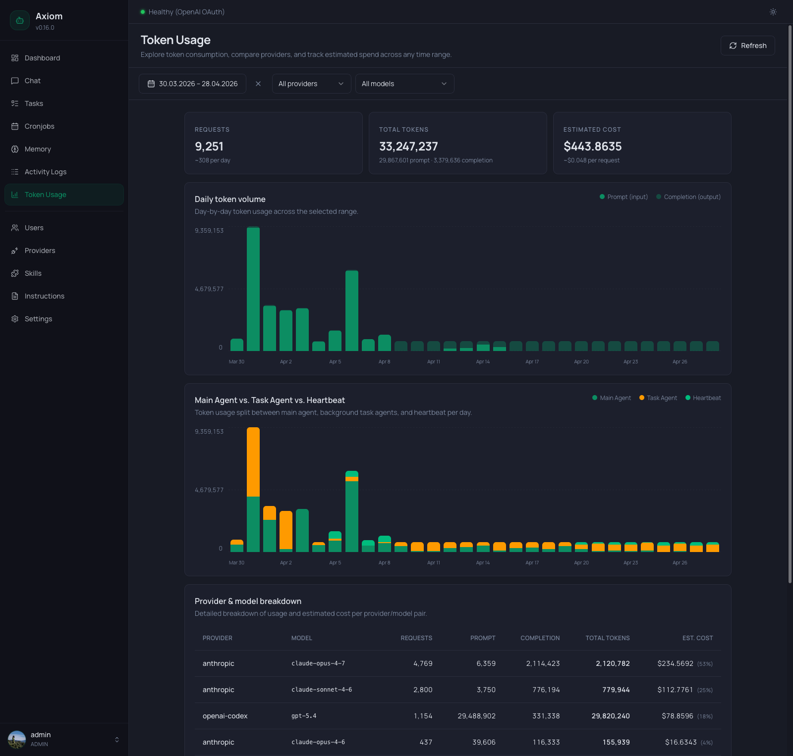

# Token Usage

Token Usage is the consumption analytics page — how many requests went out, how many tokens were spent, and what it cost. Every row in the underlying database is one model request; this page rolls them up by day, by provider/model, and by who initiated the call (chat agent, task agent, or heartbeat).

> **Admin only.** Regular users don't see this page.

> **Where do the numbers come from?** The agent records prompt and completion token counts on every model response. Cost is *estimated* by multiplying those counts against the `tokenPriceTable` from your [`settings.json`](../reference/settings) — if a model isn't in that table, its cost shows as `$0.00` even though tokens were used. Add a price entry to fix it.

## Refresh

The header has a single `Refresh` button. The page does not auto-poll — every load and every click of `Refresh` re-fetches all underlying endpoints. The button is disabled while a fetch is in flight.

## Filter toolbar

Below the header, three filters control the entire page. Changing any of them re-runs the query and updates every section in sync.

| Filter         | Notes                                                                                                |
|----------------|------------------------------------------------------------------------------------------------------|
| **Date range** | The standard picker — presets (Today, Yesterday, last 7 days, …) plus custom *From* / *Until* dates. Sets the analysis window for everything below. |
| **Provider**   | *All providers* by default, or one specific configured provider. Picking a provider clears the model filter automatically. |
| **Model**      | *All models* by default. The list is scoped to the currently selected provider, so you only see models that actually exist for that provider in the data. |

The KPI cards, both charts, and the breakdown table all reflect the same filter state. There's no "compare" view — to compare two providers, set the filter once, note the numbers, then switch.

## KPI row

Three cards across the top, each summarizing the *currently filtered range*:

| Card               | Number                                              | Sub-line                                                  |
|--------------------|-----------------------------------------------------|-----------------------------------------------------------|
| **Requests**       | Total model requests in the range.                 | Average per day across the range (`~N per day`).          |
| **Total Tokens**   | Prompt + completion tokens combined.               | Split as `<prompt> prompt · <completion> completion`.     |
| **Estimated Cost** | Sum of estimated cost over the range, formatted as currency. | Average cost per request (`~$X per request`), or `—` if the range had zero requests. |

Numbers respect the filter — if you've narrowed to a single provider/model, all three cards reflect just that subset.

## Daily token volume chart

A stacked bar chart, one bar per day in the selected range:

- **Bottom segment (solid primary color)** — prompt (input) tokens.
- **Top segment (light primary)** — completion (output) tokens.
- **Y-axis** — three labels: `0`, half-max, and the maximum total across all visible days (auto-scaled).
- **X-axis** — date labels. The frequency adapts to the range:
  - ≤ 14 days: every day labeled.
  - 15–31 days: every 3rd day.
  - > 31 days: every 7th day.
- **Hover** — a tooltip showing the full date, prompt count, completion count, and estimated cost for that day.

Days with zero tokens render as flat (no bar). Days with very few tokens render with an 8 % minimum height so they're still visible — that's a rendering trick, not the actual relative size; trust the tooltip for precise numbers.

If the filter excludes everything that has data, the chart card stays visible but shows an inline empty message instead of bars.

## Main Agent vs. Task Agent vs. Heartbeat chart

A second stacked bar chart, broken down by *who made the request*. **Only shown when there are non-zero tokens from task agents or the heartbeat in the current range** — for chat-only deployments this card disappears.

Stack order from bottom to top:

| Color           | Source                                                               |
|-----------------|----------------------------------------------------------------------|
| Primary (green) | **Main Agent** — chat sessions, including ones routed via Telegram.  |
| Amber           | **Task Agent** — every background task run (user, agent, cronjob, consolidation). |
| Emerald         | **Heartbeat** — the [agent heartbeat](../settings/agent-heartbeat) job. |

Same axes, same auto-stepping date labels, same hover tooltip pattern as the daily chart — but the per-day total can differ slightly from the daily chart in deployments where some sessions don't get attributed (rare; treat both charts as the canonical view).

## Provider & model breakdown table

Below the charts, a flat table — one row per `(provider, model)` pair that had any activity in the range. Columns:

| Column             | Notes                                                                              |
|--------------------|------------------------------------------------------------------------------------|
| **Provider**       | The configured provider name (e.g. `anthropic`, `openai-codex`).                  |
| **Model**          | Monospace, the exact model identifier the request was sent to (e.g. `claude-opus-4-7`). |
| **Requests**       | Number of completed model requests for this pair.                                  |
| **Prompt**         | Total prompt tokens.                                                               |
| **Completion**     | Total completion tokens.                                                           |
| **Total tokens**   | Sum, bold.                                                                         |
| **Est. cost**      | Currency. When more than one row is present, a small percentage in parentheses (`(53%)`) indicates this row's share of the total cost across the table. |

There's no sort control — rows come back ordered server-side by total cost, descending. Use the filter toolbar to narrow further instead of sorting.

### Totals row

A bold row at the bottom with a double border on top sums every numeric column. The percentage column is omitted in the totals (since it would always read 100 %).

If a model isn't in the `tokenPriceTable`, its row shows real token counts but a `$0.00` cost — the totals row reflects that.

## Empty states

Three distinct messages, depending on what's missing:

- **No usage at all** — *"No token usage yet."* Renders when the database has zero recorded requests across all time. The KPI row, charts, and table are all hidden.
- **No usage in current filters** — *"No usage matches these filters."* The KPI row stays visible (showing zeros), but the charts and table are replaced by this card. Suggests widening the date range or clearing provider/model filters.
- **No daily data to chart** — *"No daily usage to chart for the current filters."* Shown inside an otherwise visible chart card when the chart specifically has nothing to draw (e.g. all rows are missing day timestamps).

## See also

- [Settings → Agent](../settings/agent) — the active provider and model. Switching here changes which provider future requests go through, which is what shows up here later.
- [Settings → Tasks](../settings/tasks) — the default task provider. Task-agent rows in the breakdown table are typically attributable to whatever this is set to.
- [Settings → Agent Heartbeat](../settings/agent-heartbeat) — controls when heartbeat tokens get spent (enable/disable + schedule).
- [`settings.json` Reference](../reference/settings) — where the `tokenPriceTable` lives. Add an entry to make a model's cost stop being `$0.00`.
- [Activity Logs](./activity-logs) — for *what* the agent actually did with those tokens (every tool call, full input/output).
