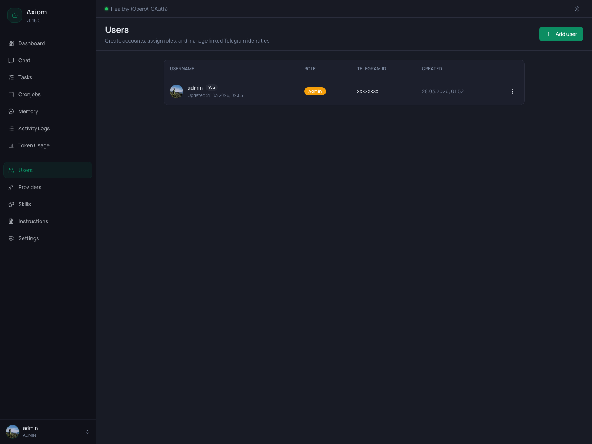

# Users

The Users page is where you add, remove, and manage local accounts for the Axiom web UI. Each row is one entry in the local `users` table — username, role, optional Telegram link, and timestamps. The actual linking of Telegram identities to accounts happens elsewhere (see [Telegram linking](#telegram-linking) below).

> **Admin only.** Regular users don't see this page.

> **Multi-tenancy reminder.** Axiom is a single-tenant agent — adding a user *does not* spin up a separate agent. Every account talks to the same agent, sees the same memory, and shares the same Settings. Roles control *administrative access to the UI*, not data isolation. The only thing that's actually scoped to the user is their [User Profile in Memory](./memory#user-profile).

## Header

A single primary button on the right:

- **Add user** — opens the create dialog (see [Add user dialog](#add-user-dialog) below).

There is no Refresh button — the list is loaded on mount and re-fetched after any successful create / edit / delete.

## Users table

### Columns

| Column         | Notes                                                                                              |
|----------------|----------------------------------------------------------------------------------------------------|
| **Username**   | Avatar + username + a `You` badge for the currently signed-in account. Below the username, a small `Updated <date>` line shows when the row was last modified. |
| **Role**       | `Admin` (amber badge) or `User` (green badge). See [Roles](#roles).                                |
| **Telegram ID**| The numeric Telegram user ID if the account is linked, monospace. `Not linked` otherwise.          |
| **Created**    | Local timestamp (medium date + short time).                                                        |
| **⋮**          | Per-row menu — Edit, Delete.                                                                       |

Clicking anywhere on a row opens the edit dialog.

### Avatars

The avatar logic is simple:

- **Linked to Telegram** → the user's Telegram profile photo is fetched from `/api/telegram-users/avatar-by-telegram-id/<id>` and rendered as a 36 px round image. If the photo can't be loaded (no avatar set, network error), the cell falls back to the initial.
- **Not linked** → a round badge with the user's first initial on a tinted background.

Avatars are purely cosmetic — they have no bearing on auth or routing.

### Empty state

When the table is empty (nothing has been created yet, *or* the only admin was somehow removed), you see a centered users icon and the message *"No users found."*. Create a fresh account via **Add user**.

## Roles

Two roles, hard-coded:

| Role        | What they can access                                                                                              |
|-------------|-------------------------------------------------------------------------------------------------------------------|
| **`admin`** | Everything — every sidebar entry, every Settings panel, all of Users. The first admin is bootstrapped via environment variables on the very first run; see [Configuration](../guide/configuration). |
| **`user`**  | Only the [Chat](./chat) page. Every other sidebar entry shows a locked screen explaining the page is admin-only. |

There is no per-feature permission system. *Admin* means "operator of this Axiom deployment"; *user* means "someone who's allowed to talk to the agent through this web UI". For finer-grained control, run a separate Axiom instance per audience.

## Add user dialog

Opened by the **Add user** button. Three fields:

| Field      | Notes                                                                                              |
|------------|----------------------------------------------------------------------------------------------------|
| **Username** | Required. Free text. Used for login and as the filename for the user's profile under [`/data/memory/users/<username>.md`](./memory#user-profile). Pick something filesystem-safe (lowercase letters, digits, hyphens). |
| **Role**     | `User` (default) or `Admin`. See [Roles](#roles).                                                |
| **Password** | Required, **minimum 4 characters**. Plaintext only at submission — stored hashed in the database. |

Hit **Save** to create. On success the dialog closes, a green banner appears at the top of the page, and the new row is in the table.

## Edit dialog

Opened by clicking a row or selecting *Edit* from the row menu. Same dialog as Add, with two differences:

- **Username is hidden.** Once an account is created, you can't rename it — username doubles as a memory-file identifier and a session foreign key, so changing it would orphan history. To "rename" a user, create a new account and delete the old one.
- **Password becomes optional**, relabeled **Reset password**. Leave blank to keep the current password unchanged; type a new value to replace it.

Resetting a password does not log the affected user out of any active sessions automatically. To force-logout, you can additionally restart the backend, but the standard expectation is that the user simply uses the new password on their next login.

## Delete

Selecting *Delete* from the row menu opens a `ConfirmDialog`:

> **Delete `<username>`?** This action cannot be undone.

A few rules:

- **You can't delete yourself.** The *Delete* item in the row menu is disabled for the currently signed-in account. To remove your own account, sign in as a different admin first.
- **Memory files stay on disk.** Deleting a user removes the row from the database, but `/data/memory/users/<username>.md` is *not* removed automatically — it lives on as a historical artifact. Delete it manually if you want a clean wipe.
- **Telegram link is dropped.** If the user was linked to a Telegram identity, that link is broken — the corresponding row in the telegram-users table goes back to "unassigned" and can be linked to a different account.
- **Past chat history is preserved.** Sessions and messages reference the user by id, so deleting the user does not delete history. The history just shows the (now-orphaned) id; the UI typically renders this as a missing user.

## Telegram linking

The **Telegram ID** column is read-only here — it just *displays* whether an account is linked. The actual linking happens in **[Settings → Telegram](../settings/telegram#telegram-users)**:

1. A new Telegram user messages the bot.
2. They appear in the Telegram-users panel as *unassigned*.
3. You approve them and pick which Axiom user account to assign their identity to.
4. The Telegram ID then shows up here.

This split exists because Telegram users have their own metadata (display name, username, language code, photo) that doesn't map cleanly onto the local `users` table. The Telegram-users management is its own thing; this page just surfaces the result.

A single Axiom user can only be linked to one Telegram identity at a time.

## See also

- [Configuration](../guide/configuration) — how the first admin is bootstrapped via environment variables.
- [Settings → Telegram](../settings/telegram) — the actual Telegram user-approval and assignment flow.
- [Memory → User Profile](./memory#user-profile) — the per-user `users/<username>.md` file each account gets.
- [Chat](./chat) — the only page non-admin users can access.
